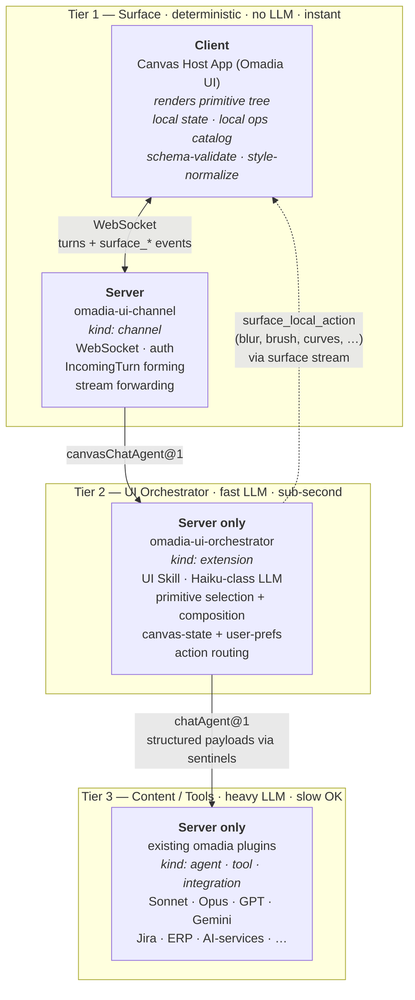

# Omadia UI — Concept

> A persistent canvas surface for the Omadia Agentic OS. The agent synthesises UI live the way it synthesises prose today — on a blank canvas, in the layout and composition that fit the user's task and preferences in the moment.

Version 0.5 — adds forward-compatibility hooks for shared canvases (group-owned, multi-user collaboration as future v2+). v0.4 baseline: 2D architecture (Client/Server × Tier 1/2/3), editor-class primitives, local operations catalog, multiple canvases, context-aware preferences, omadia-canvas-protocol versioning. Defers dynamic visual skinning (composition idioms instead). Cross-channel state marked as depends-on-omadia-core.

---

## Vision

Chat is the "DOS era" of LLM interaction: powerful, but linear, text-only, single-stream. Omadia UI is the next layer: a desktop surface where the agent **materialises live UI** (text, lists, tables, panes, media, editor regions — composed from a fixed vocabulary of primitives) as it orchestrates a request across source systems.

The canvas is **persistent, multi-turn, stateful**, its own surface with a clean mode-switch next to the chat channels. The user's tools (Jira, ERP, HR, …) stay where they are — Omadia UI replaces only the manual aggregation, comparison, triage and editing work on top of them.

The UI is **not authored by a designer and not picked from a theme menu**. It is generated per turn from a fixed vocabulary of primitives, in a layout the agent infers from the user's preferences, the use case and conversational requests. Top-tier LLMs already know what a Norton Commander layout, a Photoshop workspace or a Dashboard look like — they can express any of these (and mix them) by composing the same primitive vocabulary, rendered in the single shipped Omadia theme.

The bottleneck for what the canvas can show should be the model, not the architecture. The concept must be ready for the next 1–2 LLM generations (Claude Mythos, GPT-6, real-time models) without architectural rework.

---

## Architecture — Two Dimensions

UI work is split across two orthogonal dimensions:

- **Tier** = latency/LLM-load class (1 = none/instant, 2 = small/fast, 3 = full/long-running).
- **Side** = where it runs (Client = user's machine; Server = omadia core deployment).

| | **Client** (user's machine) | **Server** (omadia core) |
|---|---|---|
| **Tier 1 — Surface** *(deterministic, no LLM, instant)* | **Canvas Host App** (Omadia UI)<br>• renders primitive tree<br>• holds local state (selections, scroll, drag, brush buffer, …)<br>• **local operations catalog** (brush, blur, curves, audio-trim, video-cut, …)<br>• schema-validate + style-normalise | **`omadia-ui-channel`** *(kind: channel)*<br>• WebSocket endpoint + auth<br>• `IncomingTurn` forming<br>• stream forwarding<br>• no LLM logic |
| **Tier 2 — UI Orchestrator** *(small/fast LLM, sub-second)* | — | **`omadia-ui-orchestrator`** *(kind: extension)*<br>• UI Skill (composition-idiom library)<br>• Haiku-class LLM (configurable)<br>• primitive selection + composition<br>• action routing (local Tier-1 vs Tier-3)<br>• canvas-state + user-prefs store<br>• per-session turn serialisation |
| **Tier 3 — Content / Tools** *(heavy LLM + slow tools OK)* | — | **Existing omadia plugins** *(kind: agent / tool / integration)*<br>• Sonnet, Opus, GPT, Gemini, …<br>• Jira, ERP, HR, AI-background-removal, …<br>• long-running operations |



**Latency paths:**

1. **Local interaction** (scroll, hover, drag, brush stroke, simple filter) — Tier 1 Client only. No server call, no tokens, <16ms.
2. **Local-routed action** ("apply blur to selection") — Tier 2 decides "local op", emits `surface_local_action` to Tier 1 Client. Sub-second.
3. **UI composition** ("change to dashboard layout") — Tier 1 → Channel → Tier 2 → back. Sub-second.
4. **Content request** ("which of them are on vacation?") — full chain Tier 1 → Channel → Tier 2 → Tier 3 → Tier 2 → Tier 1. Seconds+. Tier 1 stays responsive throughout (skeleton states; the rest of the canvas keeps working).

---

## Tier 1 — Surface (Client + Server)

### Client: Canvas Host App (Omadia UI)

The desktop application. Native (tech stack deliberately unspecified — Tauri/Electron/native/web-PWA decided at spike time).

**Responsibilities:**

- Render the current primitive tree against the single Omadia theme.
- Apply tree mutations from Tier 2 (snapshot replace, patch, local action, action result, errors) via the streaming event grammar. Honours `surfaceSeq` and `treeRevision` — discards out-of-order or stale events.
- Hold all local UI state: scroll, hover, focus, accordion state, unsubmitted form inputs, selections, drag positions, undo stacks.
- **Local operations catalog**: deterministic, instant operations the host implements natively. Declared at capability handshake. Editor-class operations live here for performance — see "Local Operations Catalog" below.
- Send to Tier 2: user actions with semantic consequence (button clicks, form submits, conversational input, layout-change requests). Each is a new turn.
- Optimistic UI for tier-2-bound actions; skeleton states for tier-3-bound waits.
- **Schema-validate every incoming tree** against the primitive whitelist and trait spec. Reject anything else hard.
- **Apply deterministic style normaliser** after Tier-2 output (light job now since style is theme-fixed: trims any out-of-theme style hints, applies default tokens).

**Multiple canvases (Spaces-style):** Host App holds N canvases per running instance (default 1, user can add). Switching between canvases is client-local (hotkey, indicator). Each canvas has its own `canvasSessionId`. Single Host App instance per user system; runs fullscreen (Win-3-in-DOS analogy, fully overlays host OS) or windowed.

### Server: `omadia-ui-channel` (kind: channel)

Thin server-side counterpart to the Host App. Server-hosted plugin under `middleware/packages/omadia-ui-channel/`, manifested as `kind: channel` with `capabilities: [text, canvas]`, `dispatchService: "canvasChatAgent@1"`.

**Responsibilities:**

- Host the WebSocket endpoint the Host App connects to.
- Authenticate the user (reuses omadia core auth — local + OIDC).
- Form `IncomingTurn` from client events (`channelId`, `tenantId`, `userId`, `conversationId`, `canvasSessionId`, payload).
- Forward the stream of surface events from Tier 2 back to the client. No transformation, no LLM, no domain logic.
- Honour the `dispatchService` field — wire its `TurnDispatcher` to `canvasChatAgent@1`.

The channel is intentionally thin — if a second Canvas surface ever ships (web-PWA, mobile, …), it ships as a separate channel plugin against the same Tier-2 API.

---

## Tier 2 — UI Orchestrator (extension plugin)

Server-side. New plugin under `middleware/packages/omadia-ui-orchestrator/`, kind `extension`, publishes `canvasChatAgent@1`.

**Plugin manifest sketch:**

```yaml
identity:
  kind: extension
  id: omadia-ui-orchestrator
provides: ["canvasChatAgent@1"]
requires: ["chatAgent@1", "memoryStore@1", "crossChannelConversationMemory@1"]
permissions:
  llm_models_allowed: ["claude-haiku-4-5*", "claude-sonnet-4-*"]
  llm_calls_per_invocation: 8
  memory_reads: ["ui-prefs/**", "canvas-state/**"]
  memory_writes: ["ui-prefs/**", "canvas-state/**"]
config:
  ui_orchestrator_model: "claude-haiku-4-5-…"
  canvas_protocol_version: "1.0"
```

**Per-session turn serialisation:** mutex per `canvasSessionId` to ensure single-writer-per-session semantics on the canvas-state store (which is filesystem-backed and not concurrency-safe by itself).

**What it does per turn:**

1. Receives incoming turn from the canvas channel.
2. Acquires the session mutex.
3. Loads canvas state from `memoryStore@1` at `canvas-state/<tenantId>/<canvasSessionId>` and user preferences from `ui-prefs/<tenantId>/<userId>/<contextKey>` (context-aware, see Identity Model).
4. Decides: **local action** (covered by Tier-1 operations catalog), **UI composition** (style or layout change), or **content-bound** (needs data from Tier 3).
5. Local action → emit `surface_local_action` event to Tier 1.
6. UI composition → small LLM call with UI Skill + current tree + prefs → emit `surface_snapshot` or `surface_patch`.
7. Content-bound → delegate to `chatAgent@1`, sub-agents return structured data via sentinel envelope, Tier 2 composes primitive tree around the data, emit events.
8. Write back updated canvas state (always); update user prefs (if the user adjusted them); increment `treeRevision`.
9. Release the session mutex.

### The UI Skill

Large system-prompt block, prompt-cached. Contains:

- **Primitive catalogue with schemas, traits and examples.**
- **Composition-idiom library**: when the user references a classic UI layout (Norton Commander, Spotlight, Wizard, Dashboard, Photoshop workspace, OS/2 Workplace Shell, …), translate it into the equivalent primitive composition in the Omadia theme. **Do not attempt visual mimicry** — the Omadia theme always renders the visuals; idioms are layout/composition hints only. Examples:
  - "Norton Commander" → two `pane` side-by-side, each with a `list`, shared `toolbar` below.
  - "Wizard" → `container` with step-`tabs` + `form` per step + `toolbar` (back/next).
  - "Spotlight" → centred `input` + `list` of hits beneath.
  - "Dashboard" → `grid` of `container` with `chart`, `status`, KPI-`text`.
  - "Photoshop workspace" → `canvas-region` centre, `toolbar` left, `inspector` (`form` with context-binding) right, `tree` (layer stack) bottom-right.
- **Composition heuristics**: when in doubt, prefer fewer panes and more containers; prefer table over many cards when data has uniform shape; align controls in toolbars.
- **Style-negotiation protocol**: when the user expresses a layout preference, paraphrase the interpretation in one sentence, render the proposal, offer micro-corrections.
- **Consistency rule**: preserve structure across turns unless the user signals a change.
- **Interaction model**: every user action arrives as a new turn — you receive the last tree and the action.
- **Action-routing rule**: before calling Tier 3, check whether the action is in the Tier-1 local operations catalog. If yes, emit `surface_local_action` and skip Tier 3.
- **Safety clause**: only the listed primitives are valid; if a use case seems to need a new one, express it as a composition or say it cannot be done.

---

## Tier 3 — Content Agents (with one new convention)

Existing omadia agents/tools/integrations, unchanged in interface. New optional convention for canvas-aware tools/sub-agents: return result as a **pure-JSON sentinel envelope** (the orchestrator's parser is `JSON.parse`-based):

```json
{
  "_pendingStructuredPayload": {
    "prose": "Three people are under budget — Anna, Bernd, Cara.",
    "data": { "rows": [{"owner":"Anna","budgetRemaining":5}, …] },
    "dataRefId": "qry-abc",
    "actions": []
  }
}
```

Mirrors the existing sentinel pattern (`_pendingUserChoice`, `_pendingSlotCard`, `_pendingRoutineList`). Classic channels render `prose` and ignore the rest.

**Tools with editor-class operations** (e.g. `apply_ai_background_removal`, `transcribe_audio`, `extract_subjects_from_image`) live here — anything that takes time, calls an external service, or invokes an AI model. Standard editor operations (blur, brush, curves, …) live in the Tier-1 local catalog, not here.

**Plugin-API change** (PR for `byte5ai/omadia` main): documented optional `structured?` output-envelope convention for tools/sub-agents.

---

## Service Naming Convention (versioned ↔ unversioned)

Capability names in manifests are **versioned** (`canvasChatAgent@1`). Runtime service-registry lookups use the **unversioned base name** (`canvasChatAgent`) — existing pattern in `pluginContext.ts:213-216` and `plugin.ts:114`.

**Convention:**

- Manifests declare `provides: ["canvasChatAgent@1"]` and `requires: ["chatAgent@1", "memoryStore@1"]`. Versions participate in capability-resolution at boot.
- Boot wiring strips the `@N` suffix when populating the runtime service map.
- All `ctx.services.get(...)` calls use the unversioned key.
- Version conflicts at boot fail fast, never silent picks.
- Same convention applies to `channel.dispatchService`.

---

## Channel ↔ Tier-2 Routing

`CoreApi.handleTurnStream` has no service-selector parameter; `TurnDispatcher` is wired at boot to one orchestrator service.

**Additive SDK extension**: `channel.dispatchService?: string` in the channel manifest. Boot wires the channel-specific dispatcher to the resolved service. Defaults to `chatAgent@1` for classic channels.

---

## Streaming Surface Event Grammar

`SemanticAnswer` carries the final shape. The streaming grammar carries incremental updates during a turn. Existing `ChatStreamEvent` union (`chatAgent.ts:374-500`) gets additive new members — classic channels ignore unknown types.

**Every surface event carries:**

```ts
{
  canvasSessionId: string;
  surfaceSeq: number;        // transport-layer ordering, monotonic per canvasSessionId
  treeRevision: RevisionId;  // opaque revision identifier of the tree
  // event-specific payload below
}
```

`treeRevision` is deliberately specified as an **opaque identifier**. In v1 it is implemented as a monotonic integer (single-writer model). In v2+ (shared canvases) it may become a Lamport timestamp, vector clock, or CRDT-style operation id — wire format unchanged. Patches reference revisions only by equality, never by arithmetic.

The **channel plugin acts as the fan-out point** for surface events: in v1 it forwards 1:1 to a single connected client; in v2+ it multi-casts to all currently-connected members of a shared canvas. The event grammar itself is unchanged between v1 and v2 — fan-out is a channel-implementation detail, not a protocol concern.

| Event | Causal fields | Carries | Purpose |
|---|---|---|---|
| `surface_snapshot` | `producesRevision: N` | full primitive tree | Initial render / full replace; starts new revision |
| `surface_patch` | `basedOnRevision: N`, `producesRevision: N+1` | tree-path-targeted mutations | Incremental update; client rejects if `basedOnRevision` mismatches |
| `surface_data_ref_created` | `revision: N` | `{dataRefId, schema, sizeHint, signedToken, expiresAt}` | Bulk data available behind signed reference |
| `surface_data_ref_invalidated` | `revision: N` | `{dataRefId, reason}` | Reference expired / changed |
| `surface_action_result` | `forActionId, basedOnRevision: N` | `{status, message?, followUpPatch?}` | Result of a user-triggered action |
| `surface_local_action` | `revision: N` | `{operation, params}` | Instructs Tier 1 to execute a local operation from its catalog (blur, brush, curves, …) — no server round-trip needed |
| `surface_error` | `revision: N` | `{severity, message, scope}` | Render-side validation failure / dataRef denied / etc. |

**Client rules:**

- Snapshots reset state to `producesRevision`.
- Patches require matching `basedOnRevision`; otherwise drop and request snapshot.
- `surface_local_action` is processed against the current local state, no revision change unless followed by a patch.
- `surfaceSeq` is the transport-layer tie-breaker; gaps trigger a snapshot request.

---

## The Primitive Vocabulary (omadia-canvas-protocol/1.0)

**24 primitives** in three groups. Criterion for inclusion: must be composable into useful structures across data-aggregation, media, and editor workloads; must be implementable by Tier 1 against the Omadia theme.

### Core (data + UI building blocks)

| # | Primitive | Purpose |
|---|---|---|
| 1 | `text` | Block or inline copy |
| 2 | `heading` | Section title |
| 3 | `container` | Group of children, optional title / border / padding |
| 4 | `list` | Ordered collection of items |
| 5 | `table` | Rows × columns |
| 6 | `tree` | Hierarchical list (also serves as layer-stack with editor traits) |
| 7 | `button` | Action trigger |
| 8 | `input` | Text entry |
| 9 | `choice` | Single-select from N (radio, dropdown) |
| 10 | `toggle` | Boolean (checkbox, switch) |
| 11 | `image` | Static bitmap content |
| 12 | `chart` | Static data-driven visual (bar, line, pie) |
| 13 | `form` | Group of inputs + submit; with context-binding trait acts as an inspector |
| 14 | `toolbar` | Action strip |
| 15 | `menubar` | Cascading menu |
| 16 | `tabs` | Sibling containers with selector |
| 17 | `pane` | Positionable / resizable container (Miro-hybrid: technically a window, visually theme-driven) |
| 18 | `status` | Read-only display |
| 19 | `progress` | Progress of an ongoing operation |
| 20 | `divider` | Visual separator |

### Editor-class primitives

| # | Primitive | Purpose |
|---|---|---|
| 21 | `media` | Audio/video with playback, scrubbing, volume; Tier 1 holds buffer |
| 22 | `canvas-region` | Pixel-editor region (Photoshop-style); Tier 1 holds buffer as opaque local state |
| 23 | `timeline` | Multi-track, frame/sample-precise time-axis (DaVinci, Logic, Premiere) |
| 24 | `vector-path` | Pen-tool curves (Photoshop paths, audio EQ curves, etc.) |

### Cross-cutting traits

Every primitive optionally carries these:

| Trait | Type | Purpose |
|---|---|---|
| `id` | string | Stable reference (patches, actions, selections) |
| `dataRef` | string (HMAC-signed) | Reference to bulk data behind the primitive |
| `selection` | `"none" \| "single" \| "multi"` + `selected: id[]` | Selection state |
| `loading` | `"none" \| "skeleton" \| "spinner"` | Loading hint |
| `error` | `{message, severity}` \| null | Per-primitive error |
| `virtualized` | boolean | Lazy-render hint for large lists/tables |
| `action` | `{type, payload}` | Click/submit/change binding |
| `style` | restricted to theme tokens (`compact` / `spacious`, `accent` on/off, …) | Density and emphasis hints within the fixed Omadia theme |
| `continuous-input` | boolean | High-frequency input (brush pressure, slider drag values) |
| `selection-region` | shape descriptor | Lasso / rectangle / magic-wand result regions |
| `realtime-output` | boolean | Tier 1 may render at 60fps from local state |
| `frame-precise-time` | `{frameRate, sampleRate?}` | Editor-grade time precision |

**Spec format**: JSON tree, delivered as Anthropic tool-use argument (`canvas_render(tree)` or `canvas_patch(patches)`). Forced schema = reliable LLM output. Schema-versioned (see "UI Standard Versioning").

**Extension process for new primitives**: maintained by Omadia/Omadia UI developers, bound to a `omadia-canvas-protocol` minor version increment, dropped via RFC + PR. Documented from day one.

---

## Local Operations Catalog (Tier 1 Client)

Tier 1 declares a catalog of operations it implements natively — deterministic, instant, no LLM needed. Tier 2 reads the catalog at capability handshake and routes actions accordingly.

**v1.0 baseline catalog** (Host App must implement):

| Domain | Operations |
|---|---|
| **Pixel** (operates on `canvas-region`) | brush, erase, fill, blur, sharpen, levels, curves, crop, resize, rotate, flip |
| **Vector** (operates on `vector-path`) | move, scale, rotate, smooth, bezier-edit |
| **Audio** (operates on `media`/`timeline`) | trim, fade, normalize, gain, mute |
| **Video** (operates on `media`/`timeline`) | trim, splice, speed, mute-track |
| **Geometry** (operates on any pane/container) | move, rotate, scale, snap |
| **Layer** (operates on `tree` with layer trait) | visibility, opacity, blend-mode, lock, reorder |
| **Selection** | rectangle, lasso, magic-wand, invert, deselect |

**Mechanic**: Tier 2 emits `surface_local_action` with `{operation, params, target}`. Tier 1 looks up `operation` in its catalog and executes locally. If unknown, Tier 1 responds with `surface_error`, and Tier 2 falls back to a Tier-3 tool call.

**Extension**: catalog versioning aligns with `omadia-canvas-protocol`. New operations require a minor protocol bump.

---

## Style — single Omadia theme + composition idioms

**No dynamic skinning in v1.** Omadia UI ships a single, designed-by-us theme — the "Omadia look", coherent across all 24 primitives. Visual variation across UI eras is **not** delivered.

**The agent can still receive era-style requests** ("zeig mir das im Norton-Commander-Stil") — but interprets them as **layout-composition hints**, not visual mimicry. The result is the requested layout (two panes with lists side by side) rendered in the Omadia theme. This is captured in the composition-idiom library in the UI Skill.

**`style` trait** stays on every primitive but in v1 only accepts **theme tokens** (`compact` / `spacious`, `accent` on/off, density levels, emphasis). Free-form style descriptions are clipped by the Tier-1 normaliser.

**Reversibility**: dynamic skinning can be re-introduced later additively — the `style` trait already exists, the Skill would gain era-knowledge sections, the normaliser would handle cross-era conflicts. No architecture change needed.

---

## Multiple Canvases (Spaces-style)

Single Omadia UI Host App instance per user system. Within that instance:

- N canvases, each with its own `canvasSessionId`, persistent across app restarts.
- User-controlled switch between canvases (hotkey, swipe gesture, palette).
- Visible indicator of current canvas (small marker, no full sidebar).
- All canvases share the user's preference store; **context-aware preferences** can be per-canvas (see Identity Model).
- No cross-canvas drag in v1 (deferred).
- Host App can run fullscreen or windowed (user choice, persistent).

**Fullscreen mode** = Win-3-in-DOS analogy: overlays the host OS entirely, Omadia UI is the workspace. **Windowed mode** = lives alongside other apps in the host OS.

---

## Identity Model

| Id | Scope | Source |
|---|---|---|
| `tenantId` | Per omadia deployment | Server config; propagated into `IncomingTurn.tenantId` (additive SDK change); defaults to `"default"` |
| `userId` | Across channels for the same human (best effort today; cross-channel merging on omadia Slice-2.5 roadmap) | Channel auth → `IncomingTurn.userRef` |
| `conversationId` | Per channel-level chat thread | Channel-native |
| `canvasSessionId` | Per persistent canvas surface | Tier-2 generated, stable across reconnects, persists across Host App restarts |
| `canvasOwnership` | Per canvas — who owns / has access | Opaque structure; v1 always `{kind: "single-user", userId}`; v2+ can extend to `{kind: "group", groupId, members: userId[]}` without breaking the wire format |
| `contextKey` | Per user-named or agent-inferred context (e.g. "default", "project-q1-closing", "private", "business") | Conversation or explicit user statement |

**Scoping rules:**

- User preferences: `memory://ui-prefs/<tenantId>/<userId>/<contextKey>` — **context-aware**. Anchored at `<contextKey>="default"`; agent infers context switches from conversation ("Now I'm working on project Q1 Closing") or per-canvas convention.
- Canvas state: `memory://canvas-state/<tenantId>/<canvasSessionId>`
- Cross-channel conversation memory: provided by omadia core via `crossChannelConversationMemory@1` capability — depends on omadia core (see "Cross-Channel" below).

**SDK change**: add `tenantId?: string` to `IncomingTurn` (`incoming.ts:6-19`), additive.

**Context-aware prefs are required** because different work contexts demand different UIs — a private-music-collection canvas should not have to share its dense-grid preference with a business-budget canvas in compact mode.

---

## Cross-Channel — Depends on omadia core

**Requirement**: a user researching on Telegram during the morning commute and continuing in Omadia UI at the office must have their canvas materialise the prior context seamlessly. This is a quality-of-life must-have.

**Dependency**: this requires a `crossChannelConversationMemory@1` capability in omadia core — a durable, user-scoped conversation memory accessible to any channel/orchestrator. Today's `ConversationHistory` is channel-local, in-memory, 10 turns / 2h TTL (`inMemoryConversationHistory.ts`) — insufficient.

**Resolution path**: separate concept/PR-stream against `byte5ai/omadia` main, owned by an agent task outside this repo. The Omadia UI orchestrator (`requires: ["crossChannelConversationMemory@1"]`) loads from this capability at the start of each turn.

**This concept does not specify the omadia core change.** It marks the dependency and assumes the capability exists by the time Omadia UI ships.

---

## Security Surface

| Risk | Mitigation |
|---|---|
| Any tool can emit a canvas sentinel; extractor today sees only content + error | SDK change: extractor receives **origin metadata** `{toolName, pluginId, declaredCapabilities}`. New extractors (`_pendingCanvasTree`, `_pendingStructuredPayload`) reject sentinels whose origin lacks the canvas-output capability. Existing sentinels unchanged |
| `dataRef` could leak cross-session | HMAC-signed: `HMAC(serverSecret, tenantId ‖ userId ‖ canvasSessionId ‖ dataRefBody ‖ expiryEpoch)`. Server endpoint re-validates signature, scope, expiry |
| LLM-injected `action` payloads could trick Tier 2 | Action types whitelisted per-primitive in schema; unknown types dropped. Handlers map to declared semantic operations only |
| Renderer rendering arbitrary JSON | Whitelist parser at Tier 1: unknown primitive type → reject. Unknown trait → reject or strip |
| `surface_local_action` could trigger arbitrary local code | Operations catalog is closed: only catalog-listed operations execute. Unknown op → `surface_error` |
| Server-secret leak | Rotating secret (24h lifetime), short-lived `dataRef` (≤ secret lifetime), graceful rotation (next-secret accepted alongside current for one rotation period) |

---

## omadia-canvas-protocol Versioning

The wire format between Tier 1 (Host App + Channel) and Tier 2 is versioned as **`omadia-canvas-protocol/1.0`** from day one.

**Mechanic:**

- Host App declares supported protocol versions during capability handshake (`["1.0"]` initially).
- Channel plugin declares the same in its manifest (`canvas_protocol_version: "1.0"`).
- Tier 2 emits only trees in negotiated version.
- Minor bumps (`1.1`, `1.2`) add primitives, traits, operations, events — additive only.
- Major bumps (`2.0`) reserved for breaking changes (none expected in v1 lifecycle).

**Versioned components:**

- Primitive vocabulary (20 core + editor primitives in 1.0; 21st primitive = 1.1 minor bump).
- Cross-cutting traits.
- Surface event grammar.
- Local operations catalog baseline.
- Sentinel envelope format.

**Documented in this repo** under `docs/protocol/1.0.md` (TBD — written during spike).

---

## SDK changes (minimal, additive against `byte5ai/omadia` main)

| Change | Where | Size |
|---|---|---|
| Add `'canvas'` value to channel manifest capabilities enum | `middleware/src/api/admin-v1.ts:136-144` + `manifestLoader.ts:409-463` | trivial |
| Add `channel.dispatchService?: string` to channel manifest | same files | one optional field |
| Add `channel.canvas_protocol_version?: string` to channel manifest | same files | one optional field |
| Service-name version-stripping convention in boot wiring | `middleware/src/index.ts:1700-1716`, `pluginContext.ts:213-216` | small additive helper |
| Wire `TurnDispatcher` to honour `dispatchService` at boot | `middleware/src/index.ts:1700-1716` + `coreApi.ts:16-25` | small refactor |
| Add `tenantId?: string` to `IncomingTurn` | `harness-channel-sdk/src/incoming.ts:6-19` | one optional field |
| Add `surface?: OutgoingSurface` to `SemanticAnswer` | `harness-channel-sdk/src/outgoing.ts:25-81` | one optional field + type |
| Add `surface_*` event family (incl. `surface_local_action`) with revision metadata to `ChatStreamEvent` union | `harness-channel-sdk/src/chatAgent.ts:374-500` | seven new discriminated members |
| Origin-metadata carry-through in sentinel extraction | `orchestrator.ts:903-919` + extractor signatures | small carry-through |
| New extractors (`_pendingCanvasTree`, `_pendingStructuredPayload`) origin-gated | `orchestrator.ts:514-590` | new parsers |
| Add `surface?: PendingCanvasSurface` to `ChatTurnResult` | `harness-channel-sdk/src/chatAgent.ts:250-326` | one optional field |
| Document `structured?` output-envelope convention | `plugin-api/src/` (new types + doc) | small interface |
| Document `canvas-output` tool capability declaration | `admin-v1.ts` permissions block | one entry |
| Document HMAC `dataRef` signing scheme + server-secret rotation | new doc + server middleware spec | doc + middleware in spike |

**Depends on omadia core (separate work-stream):**

| Required capability | Why | Status |
|---|---|---|
| `crossChannelConversationMemory@1` | Cross-channel state continuity (Telegram → Omadia UI seamless) | Out of scope for this repo; tracked as omadia-core RFC/PR-stream |

---

## State Model

| Layer | Lives in | Backed by | Concurrency |
|---|---|---|---|
| **Active canvas state** (tree, style tokens, selections, pending dataRefs, current `treeRevision`) | Tier 2 | `memoryStore@1`, namespace `canvas-state/<tenantId>/<canvasSessionId>` | Tier-2 per-session mutex (single-writer model, v1). v2+ shared canvases require CRDT-capable store or leader election — store-backend swap, no wire-format change |
| **Data refs** (bulk rows behind `dataRef`) | Tier 2 datastore | thin scoped store inside the orchestrator plugin, signed-token addressable | Append-only with TTL |
| **Render detail** (scroll, hover, accordion, unsubmitted inputs, brush buffer, audio cursor) | Tier 1 client, in memory | not persisted, lost on app close (acceptable) | single-client |
| **User preferences** | `memoryStore@1`, namespace `ui-prefs/<tenantId>/<userId>/<contextKey>` | filesystem-backed; **context-aware** | low-frequency, same per-user mutex pattern |
| **Cross-channel conversation memory** | omadia core (`crossChannelConversationMemory@1`) | depends on omadia core | provided by core |

**Editor-class state** (canvas-region buffer, timeline audio/video, vector-path geometry) lives in Tier 1 client render-detail layer. Tier 2 holds metadata + dataRefs to the underlying media files, not the pixel/sample data itself.

---

## What classic channels see

Nothing. All changes additive, conditionally engaged via the `'canvas'` capability flag and `dispatchService` field.

- `SemanticAnswer.surface` ignored by channels not declaring `'canvas'`.
- New `surface_*` events default-ignored in existing switch statements.
- `_pendingCanvasTree` and `_pendingStructuredPayload` sentinels origin-gated.
- `canvasChatAgent@1` invoked only by channels with `dispatchService`.
- `IncomingTurn.tenantId` defaults to `"default"`.

One smoke test per existing channel proves clean ignore. Migration risk negligible.

---

## Forward Compatibility: Shared Canvases (v2+)

A planned future capability: multiple users collaborating on the same canvas, conceptually parallel to a Teams group. Omadia core already supports group conversations where memory entries are scoped to all users present at creation time; Omadia UI should be able to ride on that.

**Not in scope for v1.** Not built, not implemented. But the v1 architecture has to leave room for it — refactors of identity, state, and event semantics are expensive once production users are on the system.

### Hooks already in place (v1)

| Hook | What it enables later |
|---|---|
| `canvasOwnership` as opaque structure (v1: `{kind: "single-user", userId}`) | Extends to `{kind: "group", groupId, members: userId[]}` without breaking the identity scheme |
| `treeRevision` specified as opaque identifier (v1: integer) | Wire format unchanged when the implementation moves to Lamport clocks / CRDT op-ids |
| Channel plugin as fan-out point | v2 multi-cast to all connected members is a channel-implementation detail, not a protocol change |
| Memory-Scoping delegated to omadia core (we consume `memoryStore@1` / `crossChannelConversationMemory@1`) | Group memory comes for free when core delivers group-scope on those capabilities |
| Single-instance Tier-2 assumption explicitly documented as v1 constraint | Multi-instance / CRDT store is a backend swap, expected, not a surprise |
| Reserved future event family `presence_*` (separate from `surface_*`) | Awareness data (cursor positions, "X is editing this widget", selection highlights) lands in its own stream without overloading the tree-state events |
| Local operations catalog routes through Tier 2 (not Tier 1 client direct) | Tier 2 stays the conflict-arbitration point when multiple members trigger operations simultaneously |

### Decisions explicitly deferred (v2 work)

- **Conflict resolution strategy**: CRDT (Figma-style), operational transformation (Google-Docs-style), or pessimistic locking (Miro-style per-element locks). Selection follows a survey of the field at v2 spike time, not now.
- **Awareness UX**: cursor rendering, presence indicators, "X is editing this widget" affordances. UX work, follows once the data model is set.
- **Permissions model**: view / comment / edit / admin per member. Depends on omadia core's group model — we consume what core provides.
- **Branching / forking** of a shared canvas (e.g. "experiment offline, merge back"). Open question, likely v3+.

### Things v1 must NOT do that would block v2

- Hard-code `userId` into anything that should logically be "canvas owner". Use `canvasOwnership.userId` (single-user) instead, so the swap to group is a one-line extension.
- Assume `treeRevision` is comparable with `<` or `>`. Use equality only.
- Embed presence state into `surface_*` events. Keep tree mutation events clean.
- Tie the per-session mutex to anything user-facing. It is an internal correctness mechanism, not part of the protocol.

This section becomes the input for the v2 design phase. It is not a v1 deliverable.

---

## Riskiest Assumptions

1. **Top-tier and fast LLMs can reliably emit valid primitive trees as tool-use JSON.** Likely yes for Sonnet/Opus; unproven for Haiku-class on UI-tree synthesis (omadia uses Haiku only as classifier today). Mitigation: `ui_orchestrator_model` configurable; spike with Haiku first, fall back to Sonnet if reliability below threshold.
2. **The 24 primitives + traits + local-ops catalog are expressive enough for v1's range** (data aggregation + media + basic editor workloads). Provable only after real sessions. Mitigation: protocol-versioned addition process.
3. **The Tier-1 local operations catalog is comprehensive enough that editor workloads don't constantly fall back to Tier 3.** A Photoshop-like brush stroke must not hit the server. We assume the v1.0 baseline catalog covers the common cases; AI-driven operations and external-service calls remain Tier 3 as designed.
4. **Per-session mutex in Tier 2 is enough for production concurrency.** True as long as Tier 2 runs single-instance per deployment. Multi-instance Tier 2 requires CAS-capable store or leader election — out of v1 scope, architecture allows the swap.
5. **HMAC-signed `dataRef` with rotating server secret is operationally manageable.** Standard pattern; spike must validate the rotation procedure.
6. **`crossChannelConversationMemory@1` will be delivered by omadia core in time.** Outside this repo's control. If it slips, Omadia UI can ship with per-channel context only (degraded experience) until the core capability lands.
7. **Composition-idiom library is sufficient to give era-style requests visible value** without dynamic skinning. Empirically falsifiable; if users reject "Norton Commander-as-layout-only", dynamic skinning becomes a v2 addition (reversible).

---

## Verification (no code)

1. **Use-case walkthroughs**: at least two scenarios traced step-by-step with tier responsibility and event sequence:
   - **Multi-source comparison** (Jira × ERP × HR) — data aggregation lane.
   - **Photo edit micro-task** (apply blur to selection, then AI background removal) — editor lane that exercises both Tier-1 local catalog and Tier-3 AI tool.
2. **Mockups**: 5 key screens for the data-aggregation walkthrough plus 3 for the editor walkthrough, in the single Omadia theme. Demonstrates the theme works across workload classes.
3. **Schema specification**: JSON schemas for the 24 primitives, the traits, the surface event envelope, the sentinel envelope, the local operations catalog. Built during spike; informs PR scoping.
4. **PR plan** for `byte5ai/omadia` main, ordered for smallest mergeable atomic units:
   1. `'canvas'` capability + `dispatchService` + `canvas_protocol_version` + version-stripping helper
   2. `IncomingTurn.tenantId?`
   3. `surface_*` event family with revision metadata
   4. `SemanticAnswer.surface` + `ChatTurnResult.surface`
   5. Origin-metadata carry-through + new sentinel extractors
   6. `structured?` output-envelope convention + canvas-output tool capability
   7. New `omadia-ui-orchestrator` extension plugin
   8. New `omadia-ui-channel` channel plugin
   9. `omadia-canvas-protocol/1.0` documentation in this repo
5. **Separate work-stream** against `byte5ai/omadia` main: `crossChannelConversationMemory@1` capability proposal + implementation.

---

## Critical files

**Omadia main repo (`byte5ai/omadia`):**

- `middleware/src/api/admin-v1.ts` — `'canvas'` capability, `dispatchService`, `canvas_protocol_version`, canvas-output tool capability, version-stripping
- `middleware/src/plugins/manifestLoader.ts` — accept new manifest fields
- `middleware/src/index.ts:1700-1716` — wire `TurnDispatcher`; service-name version normalisation
- `middleware/src/platform/pluginContext.ts:213-216` — service-registry version-stripping
- `middleware/packages/harness-channel-sdk/src/incoming.ts:6-19` — `tenantId?` additive
- `middleware/packages/harness-channel-sdk/src/coreApi.ts` — service-aware dispatch
- `middleware/packages/harness-channel-sdk/src/outgoing.ts` — `OutgoingSurface`, `SemanticAnswer.surface`
- `middleware/packages/harness-channel-sdk/src/chatAgent.ts:374-500` — surface event family with revision metadata
- `middleware/packages/harness-channel-sdk/src/chatAgent.ts:250-326` — `ChatTurnResult.surface`
- `middleware/packages/harness-orchestrator/src/orchestrator.ts:514-590, 903-919` — origin-metadata + new extractors
- `middleware/packages/plugin-api/src/` — `structured?` envelope convention
- new package `middleware/packages/omadia-ui-orchestrator/` — Tier-2 extension plugin
- new package `middleware/packages/omadia-ui-channel/` — Tier-1 server-side channel plugin

**This repo (`byte5ai/omadia-ui`):**

- `CONCEPT.md` — this document
- `docs/protocol/1.0.md` — protocol specification (written during spike)
- Tier-1 Host App source — tech stack TBD
