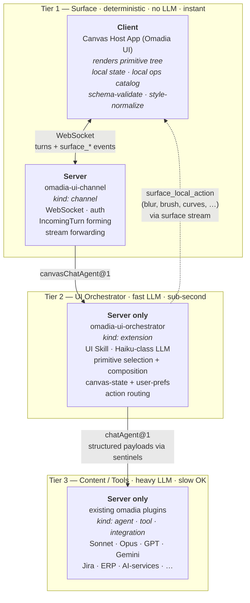

# Omadia UI — Concept

> A persistent canvas surface for the Omadia Agentic OS. The agent synthesises UI live the way it synthesises prose today — on a blank canvas, in the layout and composition that fit the user's task and preferences in the moment.

Version 0.15 — closes the two residual blockers Codex flagged on v0.14: revision notation in the Security Surface confirmation-pattern example moved to opaque `Rn` / `Rm`; `suggestedActions.validUntilRevision` retyped from `number` to `RevisionId` (opaque). `TargetRef.timeRange` extended with optional `trackId` and `clipId` so timeline-scrub on `timeline` primitives is fully addressable. v0.14 — closes Codex v0.13 blockers (three remaining): Beam target fields collapsed into the unified `TargetRef` (the v0.13 unification only reached three of four call sites — Beam was missed). `selection` cross-cutting trait removed (fourth selection-ownership collision site that escaped the v0.13 pass). Revision notation in the event grammar table moved from `N` / `N+1` integer-arithmetic style to `R0` / `R1` opaque-identifier style, restoring the equality-only contract. Plus optional fixes: `TargetRef` now ten variants (added `timeRange` for media/timeline operations; corrected count); mixed-`dataClass` container guidance; `viewState`-budget heuristic changed from "drop smallest first" to "drop non-referenced + non-selection-bearing first" with budget numbers explicitly marked as spike-tunable initial defaults. v0.13 — closes the remaining Codex blockers and cheap-wins on v0.12. **`TargetRef` as concrete discriminated union**, used everywhere the older "TargetRef" stub appeared. **Write-tool capability contract** — concrete schema convention for how a Tier-3 sub-agent tool declares its write capabilities so Tier 2 can derive `editable` / `canAddItems` / `canRemoveItems` / `canReorder` deterministically. **Selection ownership reconciled** as client view-state across all sections (State Model + Authority Split + Local Operations Catalog now agree). Region addressing pinned to `bufferContentHash` + coordinate space; textrange anchoring escaped from fragile numeric offsets via content-hash + segment anchors. Class-D / Beam **same-target arbitration** rule. `viewState` token budget with changed-containers-only and truncation fallback. `surface_mutation_resolved` lifted into the canonical Event Grammar table. `basedOnRevision` typed as opaque `RevisionId` consistent with v0.5. `surface_mutation_resolved` reserves `originAuthor` / `originSession` for v2 multi-user conflict provenance. v0.12 — closes Codex review on v0.10+v0.11 (authority/state-boundary blocker, stable-reference blocker) and adds the fourth interaction class. Major additions: **Authority Model & Stable References** (LLM owns UI structure + which data was delivered; client owns view-state; stable IDs are the lingua franca for every datapoint). **Direct Data Mutation (Class D)** — inline edit/delete/draw with optimistic UI, mutability-capabilities declared per field by the agent, async resolve via new `_pendingMutation` sentinel and `surface_mutation_resolved` event. **Async Architecture & Element-Locking** — UI never freezes during LLM work; locks scope to the smallest element that could be inconsistent, not the whole canvas. Naming: **Beam** replaces "annotation-as-prompt" (active, gestural, fits Lume's light vocabulary), **Trace** replaces session-history / audit log. Reserves Flare and Spark in a documented light-vocabulary discipline so future concepts don't trigger naming round-trips. Plus six Codex quick-wins: state-boundary table per affordance, `suggestedActions` schema with revision-basis validity, long-press arbitration rules. v0.11 — interaction model defined: intent is spatial, not locked in a text box. Inherent affordances live client-side (hard rule, extends local-ops catalog to data-structure standard ops). Context-invoke gesture (long-press primary, right-click desktop shortcut, hover dropped, double-click stays edit). First-class action panel (deterministic affordances + agent-pre-supplied `suggestedActions` + beam field, no turn on open). Beam-as-prompt with target granularity; trace as a standard element, screen otherwise noise-free. No persistent bottom prompt bar in v1 (⌘K command layer + cold-start field instead); persistent bar documented as fallback. v0.10 — input model made explicit: three prompt-input classes (canvas-level prompt · container-internal inputs · container-scoped prompt), `targetContainerId` added to `IncomingTurn`, routing rules in Tier 2. v0.9 — typography architecture locked at the concept level: three registers (structural / prose / mono), bound to three families in `docs/visual-spec.md` v0.3 (Geist · Source Serif 4 · Geist Mono). UI Skill gains a `prose-vs-structure protocol` alongside the palette-binding protocol; `style` trait extends to carry `"prose"` and `"mono"` register markers. v0.8: material identity (Lume) named and locked; accent slot becomes user-bindable across three curated palettes (Petrol / Atelier / Lagoon, Lagoon default), bound via the existing context-aware prefs model. UI Skill gained a `palette-binding protocol`. Visual specification carved out to [`docs/visual-spec.md`](docs/visual-spec.md) v0.2. v0.7 baseline: DataRef lifecycle (content-addressed, buffer ownership, GC), per-mutation mutex semantics, sub-agent cancellation, Tier-2 data cache between turns, external-effect action classification with confirmation pattern, `canvas-activate` action type, Tier-2 statelessness wrt active canvas, referential-continuity contract. v0.6: direct-gesture vs. routed-local-op split, canonical `DataRef` shape, concrete boot handshake, editor-primitive required fields, preview-vs-durable ops, contextKey per canvas, sentinel mechanism, server-assigned `surfaceSeq`. v0.5: forward-compat hooks for shared canvases. v0.4: 2D architecture, editor primitives, local ops catalog, multiple canvases, context-aware prefs, protocol versioning.

---

## Vision

Chat is the "DOS era" of LLM interaction: powerful, but linear, text-only, single-stream. Omadia UI is the next layer: a desktop surface where the agent **materialises live UI** (text, lists, tables, panes, media, editor regions — composed from a fixed vocabulary of primitives) as it orchestrates a request across source systems.

The canvas is **persistent, multi-turn, stateful**, its own surface with a clean mode-switch next to the chat channels. The user's tools (Jira, ERP, HR, …) stay where they are — Omadia UI replaces only the manual aggregation, comparison, triage and editing work on top of them.

The UI is **not authored by a designer and not picked from a theme menu**. It is generated per turn from a fixed vocabulary of primitives, in a layout the agent infers from the user's preferences, the use case and conversational requests. Top-tier LLMs already know what a Norton Commander layout, a Photoshop workspace or a Dashboard look like — they can express any of these (and mix them) by composing the same primitive vocabulary, rendered in the single shipped Omadia theme.

The bottleneck for what the canvas can show should be the model, not the architecture. The concept must be ready for the next 1–2 LLM generations (Claude Mythos, GPT-6, real-time models) without architectural rework.

---

## Architecture — Two Dimensions

UI work is split across two orthogonal dimensions:

- **Tier** = latency/LLM-load class (1 = none/instant, 2 = small/fast, 3 = full/long-running).
- **Side** = where it runs (Client = user's machine; Server = omadia core deployment).

| | **Client** (user's machine) | **Server** (omadia core) |
|---|---|---|
| **Tier 1 — Surface** *(deterministic, no LLM, instant)* | **Canvas Host App** (Omadia UI)<br>• renders primitive tree<br>• holds local state (selections, scroll, drag, brush buffer, …)<br>• **local operations catalog** (brush, blur, curves, audio-trim, video-cut, …)<br>• schema-validate + style-normalise | **`omadia-ui-channel`** *(kind: channel)*<br>• WebSocket endpoint + auth<br>• `IncomingTurn` forming<br>• stream forwarding<br>• no LLM logic |
| **Tier 2 — UI Orchestrator** *(small/fast LLM, sub-second)* | — | **`omadia-ui-orchestrator`** *(kind: extension)*<br>• UI Skill (composition-idiom library)<br>• Haiku-class LLM (configurable)<br>• primitive selection + composition<br>• action routing (local Tier-1 vs Tier-3)<br>• canvas-state + user-prefs store<br>• per-session turn serialisation |
| **Tier 3 — Content / Tools** *(heavy LLM + slow tools OK)* | — | **Existing omadia plugins** *(kind: agent / tool / integration)*<br>• Sonnet, Opus, GPT, Gemini, …<br>• Jira, ERP, HR, AI-background-removal, …<br>• long-running operations |



**Latency paths** — four distinct classes; the split between Class A and Class B is load-bearing:

| Class | Trigger | Path | Latency |
|---|---|---|---|
| **A — Direct Tier-1 gesture** | scroll, hover, drag, brush stroke, pinch-zoom, pane move/resize, click on a tool-mode toggle, accordion open/close, local form typing pre-submit | Tier 1 Client only — no server contact, no tokens | <16ms (60fps target) |
| **B — Tier-2-routed local op** | semantic command from the agent or user that resolves to a catalog operation: "apply blur to selection", "normalize this audio", "crop to selection" | Tier 1 → Channel → Tier 2 → `surface_local_action` back to Tier 1 → Tier 1 executes from local catalog | sub-second |
| **C — UI composition** | "change to dashboard layout", "show me this as a kanban", style/layout preference change | Tier 1 → Channel → Tier 2 → tree mutation back | sub-second |
| **D — Content request** | "which of them are on vacation?", "regenerate this background with AI", "fetch the Q1 invoices from ERP" | Tier 1 → Channel → Tier 2 → Tier 3 → Tier 2 → Tier 1 | seconds+; Tier 1 shows skeletons, rest of canvas stays responsive |

**Class A vs Class B is the most-violated boundary in early implementations.** A direct gesture (the user dragging the brush across pixels) is Class A — it must never round-trip the server. Triggering a named operation from a semantic intent (the agent applying that brush stroke after a user prompt, or the user clicking a "Blur Selection" button) is Class B — Tier 2 decides which operation, Tier 1 executes from its local catalog. The first Tier-1 implementation must encode this split.

---

## Authority Model & Stable References

The single most important architectural rule, and the answer to "who knows what about the canvas":

### Authority split

| Authority | What it owns |
|---|---|
| **LLM (Tier 2)** | UI structure: which canvases exist, which containers / sections / elements live in each canvas, **which data set each element was delivered with**, all schema for mutability and suggested actions. The agent is the canonical source of truth for the *structure*. |
| **Client (Tier 1)** | View-state inside elements: local sort, filter, group, pagination, hidden columns, current selection, scroll position, expand/collapse, hover, unsubmitted form input. The client is the canonical source of truth for the *current presentation*. |
| **Both communicate over** | **stable IDs/hashes on every datapoint** — the lingua franca |

The agent does **not** know how the client is currently displaying the data (sorted by which column, filtered to which subset). It does **not** need to know. The agent's references always target stable data IDs ("row with `rowKey: anna-becker`"), never view positions ("row 3 on screen"). When the user beams "summarise these three", the beam carries the three stable `rowKey`s — regardless of where they sit on screen.

This is also what keeps the agent free of view-state churn: a hundred client-side sorts produce zero turns, zero tokens. The agent only sees the view state when *it next has reason to run* — via the view-state channel below.

### View-state channel

When the client triggers a turn (because the user beamed something, submitted a form, ran an external action — all things that *do* need the agent), the request carries the relevant **`viewState`** snapshot alongside it. Tier 2 reads it for referential continuity, never writes it. Tier 2 mutating `viewState` would violate the authority split.

`viewState` is per-container, scoped to what matters for the next decision:

```ts
viewState: {
  [containerId]: {
    sort?:       { columnKey, direction },
    filter?:     { predicate },
    group?:      { columnKey },
    hiddenColumns?: columnKey[],
    page?:       { index, size },
    selection?:  TargetRef[],     // selection lives client-side; each entry is a TargetRef (see below)
    expanded?:   itemKey[],       // tree nodes / accordion-open rows
    scrollTop?:  number           // optional; only when referentially meaningful
  }
}
```

Tier 1 ↔ Tier 2 wire convention: `viewState` is part of the `IncomingTurn` (additive optional field, see SDK changes). Classic channels never set it.

**Payload budget for `viewState`** — the snapshot must stay practical at scale. The numbers below are **initial defaults, spike-tunable**; they are not measurement-grounded yet.

- **Inclusion priority** (when budget is tight, evict last-first from this list):
  1. Containers explicitly referenced by the turn's `target` (or any `targets[]` in multi-target)
  2. Containers carrying a non-empty `selection` (they are the most-common reference target)
  3. Containers whose view-state has changed since the agent last saw the canvas
  4. Everything else
- **Changed-containers-only baseline**: Tier 1 tracks `agentSeenViewStateRevision` per container and ships only deltas by default (categories 1+2+3). Category 4 is dropped unless the budget has room.
- **Hard cap (initial default)**: the serialised `viewState` blob is limited to **64 KB** per turn. Containers above the budget are evicted in reverse priority order.
- **Selection cap (initial default)**: a single container's `selection` is limited to **100 stable IDs**. Beyond that, ship `selection: { kind: 'truncated', includedCount: 100, totalCount: N, sample: [first 100 IDs by viewState ordering] }` — Tier 2 receives a clearly-marked sample and may decide to fetch full selection via a Tier-3 lookup if it really needs it.
- **Truncation fallback**: when truncation kicks in, the turn carries `viewStateTruncated: true` and Tier 2's skill rule is "ask before mutating across a truncated selection" — explicit user confirmation required.
- **Spike calibration**: the spike measures real-world `viewState` sizes (typical, p95, p99) on the sample canvases from `docs/walkthroughs.md` and adjusts the 64 KB and 100-ID numbers if needed.

### Stable IDs — a hard rule on every datatype-carrying primitive

| Carrier | Required stable-ID field | Vergeben von |
|---|---|---|
| `table` row | `rowKey: string` | Agent at build time; immutable across patches |
| `list` / `tree` item | `itemKey: string` | same |
| `chart` data point | `pointKey: string` | same |
| `canvas-region` buffer | `bufferContentHash: string` (content-addressed) | derived at write |
| `text` content segment | `textRangeAnchor` (see below — content-hash + offsets, not raw numeric offsets) | derived at write |
| Container | `containerId: string` (already in v0.7) | same |

Without stable IDs, every beam, every mutation, every referential continuity fails the first time the data reorders or the client filters. The IDs are not optional, not a nice-to-have. They are the contract.

#### `textRangeAnchor` — anchor, not raw offsets

Naked numeric offsets `{start, end}` are unstable as soon as the underlying text primitive is patched (an insertion before the anchor shifts every later offset). The stable form binds offsets to a content hash:

```ts
textRangeAnchor: {
  primitiveId: string,           // the text primitive's containerId or elementId
  contentHash: string,           // sha256[:16] of the text primitive's content at the time of anchoring
  start: number,                 // byte offset within that exact content
  end: number,                   // byte offset within that exact content
  fallbackSegment?: {            // optional — string snippet for re-resolution on hash miss
    before: string,              // ~32 chars of context before
    selection: string,           // the selected text itself
    after: string                // ~32 chars of context after
  }
}
```

Resolution on the client: if `contentHash` still matches, use offsets directly. If not, attempt re-anchoring via `fallbackSegment` (find unique match within current content). If that also fails, surface a `surface_error` for the dependent beam/mutation.

#### `bufferRegion` — region with coordinate space and revision binding

Region addressing on `canvas-region` and `media` buffers needs explicit coordinate semantics:

```ts
bufferRegion: {
  primitiveId: string,           // the canvas-region or media primitive's elementId
  bufferContentHash: string,     // sha256[:16] of the buffer at anchoring time (resolution fails on mismatch)
  bbox: {                        // axis-aligned bounding box in buffer-native coordinates
    x: number, y: number,        // in buffer pixels (not viewport pixels, not display pixels)
    w: number, h: number
  },
  shape?: {                      // optional — for non-rect selections (lasso, magic-wand)
    kind: 'rect' | 'polygon' | 'mask',
    points?: Array<[number, number]>,   // for 'polygon'
    maskHash?: string                    // for 'mask' — content-hash of a binary mask sized to bbox
  }
}
```

Buffer-native coordinates are **independent of zoom and pan** — the user can zoom in or pan around without invalidating the region. Hash mismatch means the buffer changed and the region can no longer be safely interpreted; the operation gates on `surface_error` rather than silently re-projecting.

### Implications

- **No "row 3" anywhere.** All targets address data via stable ID; positions are not addressable references.
- **Beams carry stable IDs.** Beam target is a `TargetRef` (e.g. `{kind: 'item', containerId, itemKey}` or `{kind: 'rowField', containerId, rowKey, fieldKey}`), never index-based.
- **Mutations carry stable IDs.** Class-D edits target a specific `rowKey` + field via `TargetRef`, not "the row you can see in the third position".
- **The agent's `treeRevision` advances only on agent-driven changes.** Client view-state changes do not bump it.
- **No round-trip just to see.** View-state lives client-side; the next genuine turn carries the snapshot for context.

### `TargetRef` — the discriminated union used everywhere

Every place the concept refers to "a target" — beam target, `_pendingMutation.target`, `suggestedActions.target`, `surface_local_action.target`, `surface_mutation_resolved` correlation — uses **one** canonical discriminated union with ten variants:

```ts
type TargetRef =
  | { kind: 'canvas';     canvasSessionId: string }
  | { kind: 'container';  containerId: string }
  | { kind: 'element';    elementId: string }                       // any non-data primitive (heading, divider, status, …)
  | { kind: 'rowField';   containerId: string; rowKey: string; fieldKey: string }
  | { kind: 'item';       containerId: string; itemKey: string }    // list / tree node
  | { kind: 'point';      containerId: string; pointKey: string }   // chart data point
  | { kind: 'textRange';  anchor: textRangeAnchor }                 // see schema above
  | { kind: 'region';     region: bufferRegion }                    // pixel/canvas-region — see schema above
  | { kind: 'buffer';     primitiveId: string; bufferContentHash: string }  // whole-buffer reference (canvas-region / media)
  | { kind: 'timeRange';  primitiveId: string; bufferContentHash: string;
                          start: number; end: number; unit: 'seconds' | 'samples' | 'frames';
                          trackId?: string; clipId?: string }       // media / timeline trim / splice / scrub.
                          // trackId scopes to one track on a multi-track timeline.
                          // clipId targets a specific clip on that track (rather than a raw time interval).
                          // For media (single-buffer): omit both. For timeline (multi-track): trackId required; clipId optional.
```

Tier 1 resolves a `TargetRef` against its current tree + view-state by switching on `kind`. Unknown `kind` is rejected. Tier 2 emits only the variants its operation needs. **No other target-addressing scheme exists in the concept** — Beam, mutation, suggested-action and local-op targets are all `TargetRef`.

---

## Tier 1 — Surface (Client + Server)

### Client: Canvas Host App (Omadia UI)

The desktop application. **Electron** for v1 — full reasoning, candidate comparison, risks, reversibility and the spike plan are in [`docs/tech-stack.md`](docs/tech-stack.md).

**Responsibilities:**

- Render the current primitive tree against the single Omadia theme.
- Apply tree mutations from Tier 2 (snapshot replace, patch, local action, action result, errors) via the streaming event grammar. Honours `surfaceSeq` and `treeRevision` — discards out-of-order or stale events.
- Hold all local UI state: scroll, hover, focus, accordion state, unsubmitted form inputs, selections, drag positions, undo stacks.
- **Local operations catalog**: deterministic, instant operations the host implements natively. Declared at capability handshake. Editor-class operations live here for performance — see "Local Operations Catalog" below.
- Send to Tier 2: user actions with semantic consequence (button clicks, form submits, conversational input, layout-change requests). Each is a new turn.
- Optimistic UI for tier-2-bound actions; skeleton states for tier-3-bound waits.
- **Schema-validate every incoming tree** against the primitive whitelist and trait spec. Reject anything else hard.
- **Apply deterministic style normaliser** after Tier-2 output (light job now since style is theme-fixed: trims any out-of-theme style hints, applies default tokens).

**Multiple canvases (Spaces-style):** Host App holds N canvases per running instance (default 1, user can add). Switching between canvases is client-local (hotkey, indicator). Each canvas has its own `canvasSessionId`. Single Host App instance per user system; runs fullscreen (Win-3-in-DOS analogy, fully overlays host OS) or windowed.

### Server: `omadia-ui-channel` (kind: channel)

Thin server-side counterpart to the Host App. Server-hosted plugin under `middleware/packages/omadia-ui-channel/`, manifested as `kind: channel` with `capabilities: [text, canvas]`, `dispatchService: "canvasChatAgent@1"`.

**Responsibilities:**

- Host the WebSocket endpoint the Host App connects to.
- Authenticate the user (reuses omadia core auth — local + OIDC).
- Form `IncomingTurn` from client events (`channelId`, `tenantId`, `userId`, `conversationId`, `canvasSessionId`, payload).
- Forward the stream of surface events from Tier 2 back to the client. No transformation, no LLM, no domain logic.
- Honour the `dispatchService` field — wire its `TurnDispatcher` to `canvasChatAgent@1`.

The channel is intentionally thin — if a second Canvas surface ever ships (web-PWA, mobile, …), it ships as a separate channel plugin against the same Tier-2 API.

---

## Tier 2 — UI Orchestrator (extension plugin)

Server-side. New plugin under `middleware/packages/omadia-ui-orchestrator/`, kind `extension`, publishes `canvasChatAgent@1`.

**Plugin manifest sketch:**

```yaml
identity:
  kind: extension
  id: omadia-ui-orchestrator
provides: ["canvasChatAgent@1"]
requires: ["chatAgent@1", "memoryStore@1", "crossChannelConversationMemory@1"]
permissions:
  llm_models_allowed: ["claude-haiku-4-5*", "claude-sonnet-4-*"]
  llm_calls_per_invocation: 8
  memory_reads: ["ui-prefs/**", "canvas-state/**"]
  memory_writes: ["ui-prefs/**", "canvas-state/**"]
config:
  ui_orchestrator_model: "claude-haiku-4-5-…"
  canvas_protocol_version: "1.0"
```

**Per-mutation mutex** (refined from earlier "per-turn" wording): the mutex is **per `canvasSessionId`**, but it protects each individual state mutation, **not the whole turn**. Tier 2 holds the mutex only while reading + writing the canvas-state. While Tier 3 sub-agents run, the mutex is released so that other mutations (a user typing a follow-up, another sub-agent returning) can proceed without blocking on a long-running Tier-3 call. Concurrent sub-agent returns and incoming user turns serialise via repeated short mutex acquisitions, each producing exactly one revisioned patch.

**Tier-2 is stateless wrt active canvas.** Each `IncomingTurn` carries its own `canvasSessionId`; Tier 2 never holds a "current canvas" variable. Background Tier-3 work for canvas A can emit updates even while the client displays canvas B — those updates simply land in canvas A's state and are visible when the user switches back. (Important for v2+ multi-user as well.)

**What it does per turn:**

1. Receives incoming turn from the canvas channel.
2. Acquires the session mutex briefly to load canvas state from `memoryStore@1` at `canvas-state/<tenantId>/<canvasSessionId>` (tree, dataRef refs, `treeRevision`, `contextKey`) and user preferences from `ui-prefs/<tenantId>/<userId>/<contextKey>`. Selection is **not** part of persisted canvas state — it lives client-side in `viewState.selection` and is delivered with the incoming turn (Authority Model). Releases the mutex.
3. **Referential continuity contract**: every composition or patch synthesis decision uses the loaded state as truth. References like "of them", "this row", "the highlighted ones" resolve against the in-memory tree; Tier 2 never re-asks Tier 3 for data it already has in state or in the dataRef cache (see below).
4. Decides: **local action** (Tier-1 catalog), **UI composition** (style/layout), or **content-bound** (needs new data from Tier 3).
5. Local action → emit `surface_local_action` event to Tier 1.
6. UI composition → small LLM call with UI Skill + current tree + prefs → emit `surface_snapshot` (rare; only for fundamental restructure) or `surface_patch` (default, preserves user state).
7. Content-bound → delegate to `chatAgent@1`. Sub-agents return structured data via sentinel envelope. Each return acquires the mutex briefly, mutates state, emits one revisioned patch, releases.
8. **Update written incrementally**: each patch increments `treeRevision` by 1 under the mutex; canvas-state and user prefs are written through to `memoryStore@1` at the same time.

### Per-canvas data cache (Tier-2 internal)

Between turns, Tier 2 keeps a **per-`canvasSessionId` data cache** of structured payloads returned by Tier-3 sub-agents. Cache key: the `DataRef.id`. Backing: `memoryStore@1` under `canvas-state/<tenantId>/<canvasSessionId>/cache/<dataRefId>` with the same `expiresAt` as the corresponding signed token.

Before any Tier-3 call, Tier 2 checks the cache. If the data is present and unexpired, the call is skipped and the existing dataRef is reused. This is what allows queries like "how big are they in revenue?" (Walkthrough 4 step 18) to be answered from the earlier web-search payload without a second sub-agent call.

### Sub-agent cancellation (best-effort)

When the user changes direction mid-flight (Walkthrough 4 step 9: "actually focus on their AI strategy first"), Tier 2 marks already-dispatched Tier-3 calls as obsolete. v1 uses **soft cancellation**: the Tier-3 call runs to completion (Omadia's tool API has no hard-cancel), but its return is dropped without state mutation and without patch emission. Tier 2 logs the cancellation for observability. Hard cancellation is a v2+ topic that depends on omadia-core support.

### The UI Skill

Large system-prompt block, prompt-cached. Contains:

- **Primitive catalogue with schemas, traits and examples.**
- **Composition-idiom library**: when the user references a classic UI layout (Norton Commander, Spotlight, Wizard, Dashboard, Photoshop workspace, OS/2 Workplace Shell, …), translate it into the equivalent primitive composition in the Omadia theme. **Do not attempt visual mimicry** — the Omadia theme always renders the visuals; idioms are layout/composition hints only. Examples:
  - "Norton Commander" → two `pane` side-by-side, each with a `list`, shared `toolbar` below.
  - "Wizard" → `container` with step-`tabs` + `form` per step + `toolbar` (back/next).
  - "Spotlight" → centred `input` + `list` of hits beneath.
  - "Dashboard" → `grid` of `container` with `chart`, `status`, KPI-`text`.
  - "Photoshop workspace" → `canvas-region` centre, `toolbar` left, `inspector` (`form` with context-binding) right, `tree` (layer stack) bottom-right.
- **Composition heuristics**: when in doubt, prefer fewer panes and more containers; prefer table over many cards when data has uniform shape; align controls in toolbars.
- **Style-negotiation protocol**: when the user expresses a layout preference, paraphrase the interpretation in one sentence, render the proposal, offer micro-corrections.
- **Palette-binding protocol**: when the user expresses an accent-palette preference ("mach es wärmer", "switch to Lagoon", "petrol bitte", "I want something cooler"), bind one of the three curated Lume palettes (Petrol / Atelier / Lagoon — see [`docs/visual-spec.md`](docs/visual-spec.md) §2.5) to the `accent` token. Mechanic: write the chosen palette name to `ui-prefs/<tenantId>/<userId>/<contextKey>/accent`, emit a `surface_patch` that re-tints accent tokens, brief paraphrase of the change in prose ("Lagoon — lit water"). Never offer a Settings UI; the binding happens conversationally. The Skill never picks a palette unprompted.
- **Prose-vs-structure protocol**: every `text` primitive carries a typographic register. Default is **structural** — labels, captions, instructions, eyebrows, inline UI text, all headings. The Skill opts a primitive into the **prose** register by emitting `style: "prose"` when the content is multi-sentence narration, analysis, summary, explanation, or long-form response (Walkthrough-1 step-14 narration "Three people are under budget — Anna, Bernd, Cara"; Walkthrough-4 live-research analysis pane; confirmation-modal explanatory body). The **mono** register (`style: "mono"`) carries code, terminal output, file paths, version strings, and dense IDs. Register markers map to typographic families per [`docs/visual-spec.md`](docs/visual-spec.md) §2.7; the Skill never names a font. **When in doubt, default to structural** — prose is the opt-in, not the assumption. A single sentence of narration may stay structural; two or more sentences should usually be prose.
- **Consistency rule**: preserve structure across turns unless the user signals a change.
- **Interaction model**: every user action arrives as a new turn — you receive the last tree and the action.
- **Action-routing rule**: before calling Tier 3, check whether the action is in the Tier-1 local operations catalog. If yes, emit `surface_local_action` and skip Tier 3.
- **Safety clause**: only the listed primitives are valid; if a use case seems to need a new one, express it as a composition or say it cannot be done.

---

## Tier 3 — Content Agents (with one new convention)

Existing omadia agents/tools/integrations, unchanged in interface. New optional convention for canvas-aware tools/sub-agents: return result as a **pure-JSON sentinel envelope** (the orchestrator's parser is `JSON.parse`-based):

```json
{
  "_pendingStructuredPayload": {
    "prose": "Three people are under budget — Anna, Bernd, Cara.",
    "data": { "rows": [{"owner":"Anna","budgetRemaining":5}, …] },
    "dataRefId": "qry-abc",
    "actions": []
  }
}
```

Mirrors the existing **JSON-parsed sentinel** pattern (`_pendingUserChoice`, `_pendingRoutineList` — parsed by the orchestrator via `JSON.parse` of the tool result content; see `orchestrator.ts:514+`). `_pendingSlotCard` follows a separate path (direct drain from a built-in tool state), but for tools and sub-agents emitting canvas-aware payloads the **JSON-sentinel-parse mechanism is canonical** — that is what `_pendingCanvasTree` and `_pendingStructuredPayload` use. Classic channels render `prose` and ignore the rest.

**Tools with editor-class operations** (e.g. `apply_ai_background_removal`, `transcribe_audio`, `extract_subjects_from_image`) live here — anything that takes time, calls an external service, or invokes an AI model. Standard editor operations (blur, brush, curves, …) live in the Tier-1 local catalog, not here.

**Plugin-API change** (PR for `byte5ai/omadia` main): documented optional `structured?` output-envelope convention for tools/sub-agents.

---

## Service Naming Convention (versioned ↔ unversioned)

Capability names in manifests are **versioned** (`canvasChatAgent@1`). Runtime service-registry lookups use the **unversioned base name** (`canvasChatAgent`) — existing pattern in `pluginContext.ts:213-216` and `plugin.ts:114`.

**Convention:**

- Manifests declare `provides: ["canvasChatAgent@1"]` and `requires: ["chatAgent@1", "memoryStore@1"]`. Versions participate in capability-resolution at boot.
- Boot wiring strips the `@N` suffix when populating the runtime service map.
- All `ctx.services.get(...)` calls use the unversioned key.
- Version conflicts at boot fail fast, never silent picks.
- Same convention applies to `channel.dispatchService`.

---

## Channel ↔ Tier-2 Routing

`CoreApi.handleTurnStream` has no service-selector parameter; `TurnDispatcher` is wired at boot to one orchestrator service.

**Additive SDK extension**: `channel.dispatchService?: string` in the channel manifest. Boot wires the channel-specific dispatcher to the resolved service. Defaults to `chatAgent@1` for classic channels.

---

## Prompt Input Classes

A canvas has more than one place a user can type. The vision-frame shows a global prompt bar at the bottom, a "Reply in thread" box inside a chat container, and a "Type to add a note · ⌘K to summon agent" field inside a notes container. These are **three distinct input classes** with different routing and cost. The concept must keep them separate so the implementation does not collapse them into one ambiguous text box.

| Class | Where it lives | What it does | Routing | Cost |
|---|---|---|---|---|
| **Canvas-level prompt** | ⌘K command layer (summon-anywhere) + cold-start field on an empty canvas. **No persistent bottom bar in v1** (see Interaction Model) | Speaks to the OS as a whole — summon a new container, modify/extend existing containers, cross-container operations, canvas-wide questions | `IncomingTurn` with `text`, `target.kind === 'canvas'` (or `target` absent) → Tier 2 decides scope, may go to Tier 3 | Tier-2 (always) + Tier-3 (if content-bound) |
| **Container-internal input** | Standard UI inside a container — `input`, `form`, `choice`, `toggle`, text areas | Deterministic UI interaction. Filling a form field, ticking a checkbox, typing a note body, picking a dropdown value. **No agent invocation** until an explicit submit/action | `IncomingTurn` with an `action` (`effect: local \| internal`), no free-text prompt. Local-effect actions never leave Tier 1 | Tier-1 (local) or Tier-2 (on submit) |
| **Container-scoped prompt** | A prompt field bound to one container ("Reply in thread", "summon agent" in a notes container) | "Make *this* container do something" — extend this thread, transform these rows, research into this note. The agent receives the prompt **with the container as context** | `IncomingTurn` with `text` **and** `target: TargetRef` with `kind !== 'canvas'` → Tier 2 scopes its work to that target's subtree | Tier-2 + Tier-3 (if content-bound) |

**Routing rule (Tier 2):**

- `text` present, `target` absent or `target.kind === 'canvas'` → **canvas-level**. Tier 2 may create new containers or patch any container.
- `text` present, `target` present with `kind !== 'canvas'` → **container-scoped** (or finer-scoped — `rowField`, `region`, `textRange`, etc.). Tier 2 restricts its tree mutations to the target's subtree (and may spawn a tightly-related sidecar, e.g. a confirmation modal).
- `action` present, `text` absent → **container-internal**. Deterministic; resolves against the Tier-1 local catalog or a structured action handler, never free-form synthesis.

**Why container-scoped is not just canvas-level with a hint:** scoping changes what the agent is allowed to touch. A canvas-level prompt can restructure the whole workspace; a container-scoped prompt must not. This is a permission boundary, not a convenience — it keeps "add a line to my note" from accidentally rebuilding the canvas. It is also the natural seam for v2+ shared canvases: a container-scoped prompt touches one container's state, which is the smallest unit a CRDT merge has to reconcile.

**Not every container has a scoped prompt.** It is opt-in per component type. A static KPI grid has none. A chat-thread container has one ("Reply in thread"). A notes container has one ("Type to add a note · ⌘K to summon agent"). The component schema declares whether a container exposes a scoped-prompt affordance.

**SDK change**: add `target?: TargetRef` to `IncomingTurn` (`incoming.ts`), additive. `target` is the canonical address; absent (or `kind: 'canvas'`) means canvas-level, any other `kind` means scoped. Classic channels never set it. This single field replaces the v0.10/v0.11-era separate `targetContainerId`, `targetSelection`, `targetElementId`, `targetRegion`, `targetTextRange` placeholders.

---

## Interaction Model — Intent Capture vs. Direct Manipulation

The Prompt Input Classes above define *what happens* to an input. This section defines *how the user produces one*. The guiding principle: **intent is spatial, not locked in a text box.** This is what keeps Omadia UI from collapsing back into "a chat window with rich rendering".

### Three layers of input, in frequency order

| Layer | When | Determinism | Agent turn? |
|---|---|---|---|
| **Direct manipulation + inherent affordances** | the common case — sort, filter, select, drag, resize, edit a field | full (client) | no |
| **Beam** (= "annotation-as-prompt", renamed) | contextual intent for what no affordance covers — *beam* a prompt directly at a target | hard-bound to the beamed target | yes, on submit |
| **Cold-start / new-surface prompt** | empty canvas, or a brand-new container from scratch | canvas-level | yes |

### Inherent affordances — a hard client-side rule

Every primitive type carries its deterministic standard operations **client-side**. They are **always offered**, the agent can neither forget, override, nor replace them with a turn. This extends the Local Operations Catalog from editor-only ops to data-structure standard ops:

| Primitive | Inherent affordances (client-side, no turn) |
|---|---|
| `table` | sort, filter, select, group-by, hide/show column, paginate, resize columns |
| `list` | sort, filter, select, reorder |
| `tree` | collapse/expand, filter |
| `canvas-region` | zoom, pan + editor local-ops catalog (brush, blur, …) |
| `pane` | move, resize, close, collapse |
| `form` | edit fields, validate, submit |

"Sortiere die mittlere Liste um" is therefore **not a prompt** — the user clicks that list's sort header. No agent, no turn, deterministic. The prompt channel is only for what inherent affordances cannot do.

#### State boundary per affordance

Inherent affordances split into two classes by where their effect lives — and crucially, **none of them produce a server turn**. The distinction is whether the result is purely render-detail or whether it is also visible to Tier 2 on the next turn (via the View-State channel, see Authority Model):

| Affordance class | Examples | Effect lives in | Visible to Tier 2 next turn? |
|---|---|---|---|
| **View-state** (client view-transform) | sort, filter, group-by, paginate, hide/show column, resize column, expand/collapse tree node | Tier-1 client; serialised into the per-container `viewState` blob carried alongside `IncomingTurn` | yes, via `viewState` — Tier 2 reads it for referential continuity, never writes it |
| **Selection** (intent-relevant view-state) | row select, item select, text-range select, region select | Tier-1 client; serialised into `viewState.selection` | yes — selections are the most common reference target for beams |
| **Editor-local-ops** (mutates a Tier-1-owned buffer) | brush, blur, curves, audio-trim, magic-wand-select on canvas-region | Tier-1 client buffer; produces a new content-hashed DataRef | yes, via the new DataRef (`surface_data_ref_created`) |

The state-drift question — "if the client sorts and the agent runs later, what does the agent see?" — is answered by the `viewState` channel: the client always reports its current view-state with the next turn, never changes the underlying data, never produces a turn just to sort. Sort and filter are pure presentation; the agent's reference is always to stable data IDs, never to "row 3 on screen".

### Context-invoke gesture

| Gesture | Role | Platform |
|---|---|---|
| **Long-press / click-and-hold** (~400ms) | **primary** context-invoke — opens the action panel | universal: mouse + trackpad + touch |
| Right-click | desktop-mouse shortcut for the same | desktop mouse |
| Double-click | stays edit-in-place / open — **not** context-invoke | learned, unchanged |
| Single-click | select / activate | learned, unchanged |
| Hover | **dropped** — not touch-capable, collides with tooltips | — |

Long-press is the anchor: the only gesture identical across mouse, trackpad, and touch that collides with nothing learned. Right-click is just the mouse shortcut to it. The gesture is defined abstractly as **context-invoke**, not hard-bound to "right mouse button", so a touch future maps cleanly (long-press is already the touch idiom for context actions).

**Long-press arbitration** — needed because drag, resize, selection-drag, and brush-stroke also start with press-and-hold. Rules:

| Condition during hold | Result |
|---|---|
| Pointer moves > **6 px** before 400 ms | cancel context-invoke, treat as drag (move container, select range, brush stroke, …) |
| Hold completes 400 ms with ≤ 6 px movement | open action panel |
| Hold starts inside an active text/input editable area | always edit selection — never context-invoke (text-selection gesture wins) |
| Hold starts inside an explicit drag-handle zone (`pane` title bar, corner resize affordance) | always drag/resize — never context-invoke |
| Hold starts inside a `canvas-region` while a drawing tool (brush, lasso, magic-wand) is active | always tool gesture — never context-invoke |

Right-click bypasses all of this — instant context-invoke (existing OS convention, never collides with drag because right-click has no drag semantics).

### The action panel — a first-class citizen, not an OS context menu

Context-invoke opens not a thin grey Windows/Mac menu but a **wide, Lume-styled panel**, positioned beside the target (never covering it). Three zones:

| Zone | Content | Source | Turn? |
|---|---|---|---|
| **Deterministic affordances** | the primitive's inherent affordances (Sort · Filter · Group · Select · Export …) | client-side, always | no |
| **Contextual suggestions** | agent-proposed actions that fit *this* element ("Summarise these 3", "Reassign to Daniel") | **pre-supplied in the tree** via a `suggestedActions` property on the container | no |
| **Beam field** | "Beam omadia about this…" — free intent, deterministically bound to the target | — | yes, on submit |

**Critical: no turn on panel open.** If contextual suggestions were generated when the panel opens, every context-invoke would cost ~400ms + a turn — fatal. Instead the agent supplies `suggestedActions` when it *builds* the container. The panel opens instantly with deterministic affordances + pre-supplied suggestions; a turn happens only when the user types into the beam field and submits.

Trade-off, made deliberately: `suggestedActions` costs output tokens per container (more tree content) and demands an "anticipate next actions" discipline in the Tier-2 Skill. Worth it — instant panel response is more UX-critical than the token saving.

#### `suggestedActions` schema

Each entry in the `suggestedActions` array on a container carries:

```ts
{
  id: string;                      // stable per (treeRevision, container) for idempotency
  label: string;                   // agent-authored, in the user's language
  effect: 'local' | 'internal' | 'external-effect';
  target: TargetRef;               // typically the container itself, but may scope to a sub-element
  validUntilRevision?: RevisionId; // optional; suggestion is dropped on the client when treeRevision moves past this (opaque RevisionId, equality semantics — the client tracks revision lineage, never compares arithmetically)
  validWhileDataRefs?: string[];   // optional; suggestion is dropped if any listed DataRef is invalidated
  prompt?: string;                 // pre-filled prompt text if the action expands into a beam on click
}
```

**Validity binding** is essential to avoid stale suggestions: when a patch lands that touches the container's data, suggestions whose `validWhileDataRefs` reference dropped refs are dropped client-side without a turn. Same for `validUntilRevision` — purely client-side garbage collection of obsolete suggestions.

### Beam-as-prompt — target granularity

The beam binds the prompt to a target, deterministically. No NLP inference about "which of the three lists":

| Target | Example | Binding field on `IncomingTurn` |
|---|---|---|
| Container | "make this a kanban" | `target: {kind: 'container', containerId}` |
| List/tree item | "follow up on this ticket" | `target: {kind: 'item', containerId, itemKey}` |
| Row field | "set this priority to high" | `target: {kind: 'rowField', containerId, rowKey, fieldKey}` |
| Cell / element | "why is this value so high?" | `target: {kind: 'element', elementId}` |
| Chart data point | "what drove this spike?" | `target: {kind: 'point', containerId, pointKey}` |
| Pixel region (editor) | "remove this" on an image area | `target: {kind: 'region', region: bufferRegion}` |
| Time range (media/timeline) | "trim this section" | `target: {kind: 'timeRange', primitiveId, bufferContentHash, start, end, unit}` |
| Text range | "make this shorter" | `target: {kind: 'textRange', anchor: textRangeAnchor}` |
| Empty canvas area | "build a week overview here" | canvas-level, position = click point |

Multi-target ("compare list A with list B") via multi-select before beaming → `target: TargetRef[]` carried as `targets: TargetRef[]` (plural variant on `IncomingTurn`). Deferred to v2 unless v1 use-cases demand it.

### Beam lifecycle + Trace

A pending beam sticks visibly to its target while the agent works. On resolution (success, error, or user-cancel) it disappears — the screen stays noise-free, which is non-negotiable. Failure semantics: on `surface_error` for the beam's spawning turn the beam shows an inline error chip for a few seconds and then fades; on sub-agent cancellation the beam disappears without trace.

The command history (what was beamed, what the agent built in response) lives in a **Trace** — a standard canvas-level element reachable on demand. The Trace is the *command* record, distinct from the *result* state (which is the current canvas itself). Related to `crossChannelConversationMemory@1`. Standard state of the canvas is Trace-collapsed; the user opens it to audit or replay.

### No persistent bottom prompt bar in v1 — with a documented fallback

v1 ships **without** a persistent bottom prompt bar. The canvas-level channel is ⌘K (summon-anywhere command layer) plus the cold-start field. Rationale: a persistent always-visible text field pulls the concept back toward chat — the thing we are deliberately leaving behind.

**Cold-start mechanic**: a canvas is never empty. An empty canvas shows one system-supplied prompt field, centred, Google-search style. The first agent return replaces it with materialised UI. After that, intent flows through beams + inherent affordances + ⌘K.

**Fallback (documented, not built)**: if real-world use shows the spatial-only model is too indirect — users hunting for where to type, or rebelling against the absence of a familiar input bar — a persistent bottom bar can be reintroduced as a canvas-level input. It is a purely additive UI affordance over the same canvas-level routing; no architecture change. We try radical-without first, measure, and bring it back only if the spatial model genuinely does not carry.

---

## Direct Data Mutation (Class D)

Read-only views are not enough. A user must be able to **inline-edit a field, delete an item, add a row, draw onto a region** — and the UI must feel snappy doing it. This is the fourth interaction class, alongside View-State manipulation (A), Editor-local-ops (B), and Beam (C).

### Mutability capabilities

The agent declares per-field and per-collection what the client may mutate. Without an explicit `editable: true` (or `canAddItems`, `canRemoveItems`, `canReorder`), the client treats the data as read-only — no inline UI, no edit affordance shown. **Default is read-only**, opt-in to mutable, deliberately strict to avoid rollback-hell.

```ts
// On a row field:
{
  value: 14,
  editable: true,
  type: "integer",
  min: 0,
  max: 999,
  pattern?: "…"      // optional client-checkable constraint
}

// On a list/table container:
{
  canAddItems: true,
  canRemoveItems: false,
  canReorder: true
}
```

**Capability source**: Tier 2 derives capabilities from the **Tier-3 tool schemas it has available**. If a Jira sub-agent exposes `update_ticket(id, fields)`, the listed fields are flagged editable on the corresponding row. If no write tool exists for a data class, every field is read-only. Tier 2 is the translator from "Tier 3 can do this" to "client may offer this".

#### Write-tool capability contract

Tier 2 cannot guess capabilities from arbitrary tool names. Tier-3 tools that mutate data declare their write capabilities in a **standard manifest annotation** so Tier 2 can derive `editable` / `canAddItems` / `canRemoveItems` / `canReorder` deterministically:

```yaml
# in the Tier-3 sub-agent / tool manifest
writeCapabilities:
  - dataClass: "jira.ticket"
    operation: "update"
    targetSchema:
      idField: "ticket_id"
      fields:
        - { name: "status",   type: "enum",    values: [open, in_progress, done], editable: true }
        - { name: "assignee", type: "string",  pattern: "^[a-z.]+@[a-z.]+$",       editable: true }
        - { name: "priority", type: "enum",    values: [low, medium, high],       editable: true }
        - { name: "title",    type: "string",  maxLength: 200,                    editable: true }
        - { name: "key",      type: "string",                                     editable: false }   # read-only — primary key
  - dataClass: "jira.ticket"
    operation: "create"
    targetSchema:
      containerHint: "table"
      requiredFields: [title, assignee]
  - dataClass: "jira.ticket"
    operation: "delete"
    targetSchema:
      idField: "ticket_id"
  - dataClass: "jira.ticket"
    operation: "reorder"
    targetSchema:
      containerHint: "list"
      orderField: "sequence"
```

**Tier-2 derivation rules** (deterministic, no LLM call needed at container-build time):

| Tool operation | Sets on container/field |
|---|---|
| `operation: "update"` with field-level `editable: true` | the corresponding row's field gets `editable: true` + the field-level type/constraints |
| `operation: "update"` with field-level `editable: false` | field stays read-only |
| `operation: "create"` | the parent container gets `canAddItems: true`; the required fields define the "new item template" |
| `operation: "delete"` | parent container gets `canRemoveItems: true` |
| `operation: "reorder"` | parent container gets `canReorder: true` |

Tier 2 matches `dataClass` strings to its outgoing tree by an explicit `dataClass` annotation on each agent-emitted container (`container { dataClass: "jira.ticket", … }`). Without that annotation, the container is treated as read-only — strict default.

**Mixed-`dataClass` containers** — a container may aggregate data from more than one source (e.g. a table joining Jira tickets with ERP budget data). In that case the agent declares per-column or per-field `dataClass`:

```
container {
  dataClass: { default: "jira.ticket", fields: { hoursBudget: "erp.budget", hoursLeft: "erp.budget" } },
  …
}
```

Tier-2 derivation then applies the matching `writeCapabilities` per field: Jira fields editable via `jira.ticket.update`, ERP fields via `erp.budget.update`, fields without a matching write tool stay read-only. The same primary-key resolution (`idField` per dataClass) applies per row — a mixed-source row carries multiple stable ID fields, one per dataClass, and the agent declares which row-key is the canvas-side `rowKey`.

**Why explicit manifest declarations, not inferred?** The Tier-2 Skill could in principle inspect free-form Tool schemas (input parameter names, JSON-Schema validators, etc.) and guess capabilities. That guess is unreliable and produces silent rollback-hell. The manifest annotation is the contract: a tool that wants its writes exposed to inline UI must say so explicitly, including which fields are editable. Tools that lack this annotation are simply not exposed for direct manipulation — they still work via beam ("change Anna's status to done"), which routes through the agent's full reasoning.

**Where this contract lives**: in `plugin-api/src/` as a new optional `writeCapabilities` field on the tool manifest schema; documented as the **standard write-capability convention** alongside the existing `canvas-output` and `structured?` conventions.

### Optimistic update flow

1. User edits an editable field (e.g. clicks a `status` cell with `editable: true`, picks a new enum value).
2. Client writes the new value locally **immediately** and marks the field with the **pending treatment** — subtle `accent.glow` underline / pulsing border (Lume-soft, never aggressive).
3. Client emits `_pendingMutation` sentinel back through the channel:
   ```ts
   {
     mutationId: string,        // client-generated UUID, used for resolution correlation
     target: TargetRef,         // rowKey + field, or itemKey, or regionBbox, or textRange
     oldValue: unknown,
     newValue: unknown,
     basedOnRevision: RevisionId  // the treeRevision the client saw when the user edited; opaque type (see Streaming Surface Event Grammar)
   }
   ```
4. Tier 2 receives the mutation, validates against the capability schema, then dispatches to the Tier-3 tool that owns the data class (`update_ticket(…)` or similar).
5. Tier 3 confirms / transforms / rejects.
6. Tier 2 emits **`surface_mutation_resolved`** stream event back to the client:
   ```ts
   {
     mutationId: string,
     status: 'success' | 'modified' | 'rejected' | 'invalid' | 'conflict',
     actualValue?: unknown,     // present when modified or conflict
     error?: { message, code }  // present when rejected or invalid
   }
   ```
7. Client clears the pending treatment and reconciles by status.

### Resolution status

| Status | Client behaviour |
|---|---|
| `success` | clear pending, show the value as normal |
| `modified` | take the server's `actualValue`, clear pending, briefly hint "value normalised" (e.g. trimmed string, validated number) |
| `rejected` | revert to `oldValue`, show inline error chip with `error.message` for a few seconds, then fade |
| `invalid` | revert, surface the validation message in-place; if the field is still focused, the user can correct without re-clicking |
| `conflict` | take server `actualValue`, hint "agent changed this concurrently"; the user can choose to re-apply via a one-click affordance |

### Pending pipeline

The user may keep editing while a previous mutation is still pending. The client stacks mutations in a pipeline ordered by `mutationId`. Each resolution arrives independently. If a later mutation depends on a value the server hasn't yet seen, the client serialises submission per (target, field) so the server always sees a coherent sequence.

### Validation depth — where the line is drawn

The capability schema carries only **client-checkable constraints**: `type`, `min`, `max`, `pattern`, `enum`, `required`. The client rejects user input that fails these without ever submitting (snappy). Complex business rules ("value must be unique across the list", "cannot exceed remaining budget") are **server-only** — the client submits optimistically, and a `rejected` / `invalid` status comes back if the server disagrees. Trying to ship business rules client-side would be a maintenance disaster.

### Why edit-as-prompt was rejected

Some tools (Claude Design among them) treat inline edits as auto-generated prompts ("edit text xyz to 'yadda'"). That is universal but never snappy — every keystroke roundtrip is a full LLM turn. Class D is the deliberate trade: declare capabilities once, then run client-side optimistic updates that hit Tier 3 directly, bypassing Tier-2 LLM cost. Tier 2 still routes; it does not synthesise.

---

## Async Architecture & Element-Locking

The canvas never freezes while the LLM works. This is non-negotiable for the "snappy OS" feel.

### Async by default

Every Tier-2 turn — beam submission, Class-D mutation, Class-B routed local-op, canvas-level command — runs **asynchronously**. The user keeps interacting with the rest of the canvas while a turn is in flight: scrolling, sorting other containers, drawing in a canvas-region, beaming a different element, opening Trace.

The pending state is local-to-the-affected-thing, not local-to-the-canvas:
- A beam pin is animated on its target.
- A pending mutation is marked on its field.
- Everything else is unaffected.

### Element-locking — minimal scope, never the whole canvas

When a turn is going to **mutate or replace** part of the tree, the client locks **only the smallest scope that could become inconsistent**:

| Operation | Locked scope |
|---|---|
| Class-D mutation on a single field | that field on that row only (other fields, other rows, other containers stay interactive) |
| Class-D delete of a list item | that item only |
| Beam on a container that the agent is rebuilding | the entire container (because the rebuild may replace any sub-element) |
| Sub-agent stream emitting a series of `surface_patch` events into a container | the patched sub-tree, as patches land; siblings stay unlocked |
| Editor local-op (Class B) that produces a new DataRef | the primitive whose buffer is being recomputed |

Locked = receives a subtle `pending` treatment + blocks edits and beams to that scope until resolved. The rest of the canvas including unrelated containers, View-State changes, Trace, ⌘K, all stay fully interactive.

### Same-target arbitration — Class-D mutation and Beam racing for the same target

The hairy case: a user fires a beam *and* a Class-D mutation at the same target within the same Tier-2 mutex acquire-release window, **before** the lock for the first has propagated to the client. Two competing intents in flight.

Arbitration rule, ordered first-to-last by precedence:

1. **Server-side serialisation by arrival order at the per-session mutex.** Tier 2's mutex serialises *both* `_pendingMutation` and beam-bearing `IncomingTurn`s — they are the same kind of work for the mutex. Whichever arrives first acquires; the second blocks on it.
2. **`basedOnRevision` check on the second**: when the second op acquires the mutex, its `basedOnRevision` is compared against the current `treeRevision`. If the first op produced a new revision (it did, by definition of a mutation), the second's revision is stale.
3. **Stale-second resolution**: the second op resolves with `status: 'conflict'` and the current `actualValue`. The client decides whether to re-apply by re-issuing with the current revision — this is the same conflict resolution as v2+ multi-user collision handling.
4. **Lock propagation timing**: the lock visible to the client lags the lock acquired by the mutex by ~1 RTT. The client therefore cannot rely on "I have not seen a lock yet, so no one is mutating". The server-side serialisation in step 1 is what guarantees correctness; the client-side lock is a UX nicety that prevents *visible* simultaneous edits, not a correctness mechanism.
5. **Beam-first vs mutation-first ordering** is arbitrary and not user-meaningful. The user sees whichever resolves first; the second resolves as conflict and the user gets a one-tap "re-apply on top of agent's change?" affordance.

### Edge case: user interacts with something the agent is changing

Three sub-cases, simplest to hardest:

1. **User reads the locked thing while it's locked**: allowed. Selection, hover, even copy-to-clipboard work. Only mutation/beam is gated.
2. **User submits a beam or mutation targeting a locked element**: client rejects locally with a one-line hint ("still updating — try in a moment") and does **not** stack it in the pipeline. The user can retry once the lock releases. (See same-target arbitration above for the race where lock-propagation hasn't reached the client yet.)
3. **Agent finishes mutating, but the user has meanwhile changed local view-state on that element**: view-state is preserved across the mutation; the patch lands, but the client re-applies its sort/filter/selection on top of the new data using stable IDs. Selection survives if the underlying ID still exists; falls back to empty selection if the ID was removed by the patch.

### Spike research items

Edge cases that need empirical resolution in the spike — flagged but not fully specified now:

- **Stale-DataRef during mutation**: a mutation targets a row whose underlying DataRef just expired. Spike measures whether the practical incidence justifies a richer reconciliation path.
- **Reordering during stream**: a sub-agent streams 50 row-appends while the user is sorting locally. Stable IDs ensure correctness; UX-perception (does it feel coherent?) needs measurement.
- **Burst of Class-D edits**: power-user edits 20 cells in 5 seconds; does the resolution pipeline keep up, or do we need throttling? Spike.

These are research items, not unspecified holes. The architecture above carries them; tuning happens with real numbers.

---

## Light Vocabulary — Discipline, Not Theme Park

The system uses a small, disciplined set of light-domain names because Lume is the material. New light-domain names enter the vocabulary **only when** (a) the concept they label is eigenständig genug to deserve a name, and (b) the light word makes the meaning more precise or more thinkable. Coolness alone does not qualify. Cumulative light-naming becomes marketing-speak and erodes meaning.

| Term | Means | Status |
|---|---|---|
| **Lume** | the material identity of the OS — UI condensed out of light | locked, conceptual core |
| **Glow / Halo / Aura** | visual effects in the material (selection, focus, modal aura) | locked, descriptive |
| **Beam** | a directed user-intent on a spatial target — the "annotation-as-prompt" replacement | introduced v0.12 |
| **Trace** | the command history / audit log of a canvas — a "trace of light" through what the user asked and the agent answered | introduced v0.12 |
| **Flare** | reserved — for agent-initiated attention signals (e.g. notifications, "needs your input") | reserved, may activate if and when we introduce notification concepts |
| **Spark** | reserved — for a discrete generative-initiation event distinguishable from a beam | reserved, may activate if a use case clearly differs from Beam |
| **Lumen** | a self-contained, declarative, deterministic interactive unit — UI condensed into a portable, shareable quantum of light (the Live-Interactivity extension) | **proposed**, pending vocabulary sign-off — see [`docs/interactivity-concept.md`](docs/interactivity-concept.md) + [`docs/lumens-spec.md`](docs/lumens-spec.md) |

Anything else from the light domain (Photon, Shadow, Beacon, Cast, Lens, Prism, Reflection, Ray, Shine, Glimmer, …) does **not** enter the vocabulary unless it earns its slot by labelling something that has no good name yet. The default answer to "should we call this X?" is no.

---

## Streaming Surface Event Grammar

`SemanticAnswer` carries the final shape. The streaming grammar carries incremental updates during a turn. Existing `ChatStreamEvent` union (`chatAgent.ts:374-500`) gets additive new members — classic channels ignore unknown types.

**Every surface event carries:**

```ts
{
  canvasSessionId: string;
  surfaceSeq: number;        // server-assigned, monotonic per canvasSessionId
  treeRevision: RevisionId;  // opaque revision identifier of the tree
  // event-specific payload below
}
```

`treeRevision` is deliberately specified as an **opaque identifier**. v1 implementation is a monotonic integer (single-writer model); v2+ (shared canvases) may use Lamport timestamps, vector clocks, or CRDT op-ids — wire format unchanged. Patches reference revisions by equality only, never by arithmetic.

`surfaceSeq` is **server-assigned** by the channel plugin / Tier 2. Clients may attach a separate `clientSeq` to outbound user actions for round-trip mapping, but it is never authoritative.

The **channel plugin acts as the fan-out point** for surface events: in v1 it forwards 1:1 to a single connected client; in v2+ it multi-casts to all currently-connected members of a shared canvas. The event grammar itself is unchanged between v1 and v2 — fan-out is a channel-implementation detail, not a protocol concern.

### Canonical `DataRef` shape (used in every trait and event that references bulk data)

```ts
type DataRef = {
  id: string;             // content-addressed identifier (see below)
  signedToken: string;    // HMAC signature (see Security Surface for input composition)
  expiresAt: string;      // ISO 8601 timestamp
};
```

This is the single shape. The cross-cutting `dataRef` trait carries a `DataRef`. The `surface_data_ref_created` event carries a `DataRef`. The `surface_data_ref_invalidated` event carries `{id: string, reason: string}`. No stringly-typed signed-string variant.

### DataRef lifecycle

| Aspect | v1.0 spec |
|---|---|
| **ID derivation** | Content-addressed: `id = "<kind>-<sha256(content)[:16]>"`, where `kind` is `"pixel"`, `"vector"`, `"audio"`, `"video"`, `"struct"`, etc. Same content → same id, dedup automatic |
| **Buffer ownership — pixel/audio/video/vector** | Held by **Tier 1 client** in its render-detail layer (large binary buffers never leave the client unless explicitly uploaded for a Tier-3 op). Tier 2 holds only `{id, signedToken, expiresAt}` plus content metadata in canvas-state |
| **Buffer ownership — structured payload from Tier 3** (Jira tickets, ERP rows, …) | Held by Tier 2 in the per-canvas data cache (see Tier 2). Server-fetchable via signed token for re-render or sub-agent re-use |
| **Creation — Class B durable op** | Tier 1 computes the new buffer locally, hashes it, sends `IncomingTurn { action: { type: "buffer-mutated", target, newDataRef } }`. Tier 2 confirms via `surface_patch` referencing the new id; Tier 2 also emits `surface_data_ref_created` so the system knows the ref is now live |
| **Creation — Tier-3 structured payload** | Sub-agent returns payload; Tier 2 hashes, places in cache under namespace `canvas-state/<…>/cache/<dataRefId>`, emits `surface_data_ref_created` |
| **Reference from primitive** | The `dataRef` trait on a primitive holds `{id, signedToken, expiresAt}`; the client uses the token to fetch the buffer (if buffer lives server-side) or look up its local store (if buffer is client-held) |
| **Invalidation** | (a) `expiresAt` reached → automatic; (b) explicit `surface_data_ref_invalidated` from Tier 2 when a durable op replaces the buffer or when the cache TTL fires |
| **Garbage collection** | Tier 1: drops local buffer when no live primitive references it AND its expiry has passed. Tier 2: drops cache entry on TTL. Canvas-state retains only the metadata, not the bulk content |
| **Cross-turn stability** | DataRefs survive across turns until invalidated. The next turn can reference them by id; Tier 2 looks up in cache, or the client fetches by token |

The content-addressed id is what makes durable editing tractable: every "blur applied" produces a deterministic new id, the old one stays addressable until GC. Undo/redo (v2+) can navigate the id chain.

| Event | Causal fields | Carries | Purpose |
|---|---|---|---|
| `surface_snapshot` | `producesRevision: Rn` | full primitive tree + active `omadia-canvas-protocol` + ops-catalog version | Initial render / full replace; starts new revision |
| `surface_patch` | `basedOnRevision: Rn`, `producesRevision: Rm` | tree-path-targeted mutations | Incremental update; client rejects if `basedOnRevision` mismatches and requests snapshot |
| `surface_data_ref_created` | `revision: Rn` | `DataRef + {schema, sizeHint}` | Bulk data available behind signed reference (canonical shape, see above) |
| `surface_data_ref_invalidated` | `revision: Rn` | `{id, reason}` | Reference expired / changed |
| `surface_action_result` | `forActionId, basedOnRevision: Rn` | `{status, message?, followUpPatch?}` | Result of a user-triggered action |
| `surface_local_action` | `revision: Rn`, `effect: 'preview' \| 'durable'` | `{operation, params, target: TargetRef}` | Tier 2 instructs Tier 1 to execute a catalog operation. `effect: 'preview'` does **not** mutate `treeRevision` (transient visual, undo-able locally). `effect: 'durable'` is always followed by a `surface_patch` from Tier 2 that mutates `treeRevision` — so the durable result is reflected in canvas state and (in v2+) visible to all members. Durable ops on buffer-backed primitives (canvas-region, media, vector-path) trigger Tier 1 to report the new content-addressed `DataRef` back to Tier 2 via the next `IncomingTurn` |
| `surface_error` | `revision: Rn` | `{severity, message, scope}` | Render-side validation / dataRef denied / catalog op unknown / protocol mismatch |
| `surface_mutation_resolved` | `revision: Rn`, `forMutationId: string` | `{status: 'success' \| 'modified' \| 'rejected' \| 'invalid' \| 'conflict', actualValue?, error?, originAuthor?, originSession?}` | Resolution of a Class-D mutation. Reconciles a `_pendingMutation` by `mutationId`. v2+ multi-user reserves `originAuthor` / `originSession` so a member can be shown "who applied this and from which session" — empty in v1 single-user |

`Rn` / `Rm` are **opaque `RevisionId` placeholders** in the table above — not integers, never compared with `<` / `>` / arithmetic. `Rm` produced from `Rn` is a successor in the revision lineage; equality (and only equality) is meaningful. v1 happens to implement `RevisionId` as a monotonic integer; v2+ may use Lamport timestamps, vector clocks, or CRDT op-ids without any wire-format change.

**Client rules:**

- Snapshots reset state to `producesRevision`.
- Patches require equality match between `basedOnRevision` and the client's current revision; otherwise drop and request snapshot.
- `surface_local_action` is processed against the current local state, no revision change unless followed by a patch.
- `surfaceSeq` is the transport-layer tie-breaker; gaps trigger a snapshot request.

---

## The Primitive Vocabulary (omadia-canvas-protocol/1.0)

**24 primitives** in three groups. Criterion for inclusion: must be composable into useful structures across data-aggregation, media, and editor workloads; must be implementable by Tier 1 against the Omadia theme.

### Core (data + UI building blocks)

| # | Primitive | Purpose |
|---|---|---|
| 1 | `text` | Block or inline copy |
| 2 | `heading` | Section title |
| 3 | `container` | Group of children, optional title / border / padding |
| 4 | `list` | Ordered collection of items |
| 5 | `table` | Rows × columns |
| 6 | `tree` | Hierarchical list (also serves as layer-stack with editor traits) |
| 7 | `button` | Action trigger |
| 8 | `input` | Text entry |
| 9 | `choice` | Single-select from N (radio, dropdown) |
| 10 | `toggle` | Boolean (checkbox, switch) |
| 11 | `image` | Static bitmap content |
| 12 | `chart` | Static data-driven visual (bar, line, pie) |
| 13 | `form` | Group of inputs + submit; with context-binding trait acts as an inspector |
| 14 | `toolbar` | Action strip |
| 15 | `menubar` | Cascading menu |
| 16 | `tabs` | Sibling containers with selector |
| 17 | `pane` | Positionable / resizable container (Miro-hybrid: technically a window, visually theme-driven) |
| 18 | `status` | Read-only display |
| 19 | `progress` | Progress of an ongoing operation |
| 20 | `divider` | Visual separator |

### Editor-class primitives

| # | Primitive | Purpose | Required props (v1.0) | Optional props |
|---|---|---|---|---|
| 21 | `media` | Audio/video with playback, scrubbing, volume; Tier 1 holds buffer | `mediaType: 'audio' \| 'video'`, `dataRef: DataRef`, `duration: ms` | `frameRate` (video), `resolution` (video), `sampleRate` (audio), `channels` (audio), `poster: DataRef` |
| 22 | `canvas-region` | Pixel-editor region (Photoshop-style); Tier 1 holds buffer as opaque local state | `width: int`, `height: int`, `pixelFormat: 'rgba8' \| 'rgba16'` | `dataRef` (initial content), `colorSpace`, `dpi` |
| 23 | `timeline` | Multi-track, frame/sample-precise time-axis (DaVinci, Logic, Premiere) | `tracks: Array<{id: string, kind: 'audio'\|'video'\|'marker'}>`, `timebase: {frameRate?: number, sampleRate?: number}` | `duration`, `playhead`, `loopRegion` |
| 24 | `vector-path` | Pen-tool curves (Photoshop paths, audio EQ curves, etc.) | `points: Array<{x: number, y: number, ctrlIn?, ctrlOut?}>` | `closed: boolean`, `strokeStyle`, `fillStyle` |

### Cross-cutting traits

Every primitive optionally carries these:

| Trait | Type | Purpose |
|---|---|---|
| `id` | string | Stable reference (patches, actions, selections) |
| `dataRef` | `DataRef` (see canonical shape above) | Reference to bulk data behind the primitive |
| `selectable` | `"none" \| "single" \| "multi"` | Declares the primitive's selection **mode** — whether the client may track 0, 1, or N selected items on this primitive. The agent **does not** carry the actual selected IDs; the current selection lives in `viewState.selection` (see Authority Model). This trait only governs the affordance, not the state |
| `loading` | `"none" \| "skeleton" \| "spinner"` | Loading hint |
| `error` | `{message, severity}` \| null | Per-primitive error |
| `virtualized` | boolean | Lazy-render hint for large lists/tables |
| `action` | `{type, payload}` | Click/submit/change binding |
| `style` | restricted to theme tokens (`compact` / `spacious`, `accent` on/off, …) | Density and emphasis hints within the fixed Omadia theme |
| `continuous-input` | boolean | High-frequency input (brush pressure, slider drag values) |
| `selection-region` | shape descriptor (`{kind: 'rect'\|'lasso'\|'magic-wand', …}`) | Lasso / rectangle / magic-wand result regions |
| `realtime-output` | boolean | Tier 1 may render at 60fps from local state |
| `frame-precise-time` | `{unit: 'frame'\|'sample'\|'ms', value: number}` (required when present) | Editor-grade time precision |

**Spec format**: JSON tree, delivered as Anthropic tool-use argument (`canvas_render(tree)` or `canvas_patch(patches)`). Forced schema = reliable LLM output. Schema-versioned (see "UI Standard Versioning").

**Extension process for new primitives**: maintained by Omadia/Omadia UI developers, bound to a `omadia-canvas-protocol` minor version increment, dropped via RFC + PR. Documented from day one.

---

## Local Operations Catalog (Tier 1 Client)

Tier 1 declares a catalog of operations it implements natively — deterministic, instant, no LLM needed. Tier 2 reads the catalog at capability handshake and routes actions accordingly.

**v1.0 baseline catalog** (Host App must implement). Each entry has an `effect` class:

- **`preview`** — transient visual / audio modification, undo-able locally, does **not** change `treeRevision` or canvas state. Tier 1 keeps the preview in render-detail layer.
- **`durable`** — modifies the underlying buffer / structure. Tier 2 follows the `surface_local_action` with a `surface_patch` that mutates `treeRevision` and persists in canvas state.

| Domain | Operations | Effect |
|---|---|---|
| **Pixel** (operates on `canvas-region`) | brush, erase, fill, blur, sharpen, levels, curves | `durable` |
| **Pixel transforms** | crop, resize, rotate, flip | `durable` |
| **Pixel preview** | preview-blur, preview-curves, preview-levels (for live filter dialogs) | `preview` |
| **Vector** (operates on `vector-path`) | move, scale, rotate, smooth, bezier-edit | `durable` |
| **Audio** (operates on `media`/`timeline`) | trim, fade, normalize, gain, mute | `durable` |
| **Audio preview** | preview-gain, preview-eq, scrub | `preview` |
| **Video** (operates on `media`/`timeline`) | trim, splice, speed, mute-track | `durable` |
| **Video preview** | scrub, preview-speed | `preview` |
| **Geometry** (operates on any pane/container) | move, rotate, scale, snap | `durable` |
| **Layer** (operates on `tree` with layer trait) | visibility, opacity, blend-mode, lock, reorder | `durable` |
| **Selection** | rectangle, lasso, magic-wand, invert, deselect | `preview` — selection is **client view-state** (`viewState.selection`), not canvas state. The op mutates the client's view-state, never the agent-owned tree. Tier 2 sees the resulting selection only via `viewState` on the next turn (read-only) |

**Mechanic**: Tier 2 emits `surface_local_action` with `{operation, params, target, effect}`. Tier 1 looks up `operation` in its catalog, verifies the declared `effect` matches, executes locally. If `operation` unknown or `effect` mismatched, Tier 1 responds with `surface_error`, Tier 2 falls back to a Tier-3 tool call.

For **shared canvases (v2+)**: `preview` ops stay client-local per member; `durable` ops still follow the Tier-2-revision-then-patch pattern, so all members see the same authoritative state. The mechanic does not need changing — it is already shared-canvas-safe.

**Extension**: catalog versioning aligns with `omadia-canvas-protocol`. New operations require a minor protocol bump. Catalog version is negotiated separately from protocol version at boot (see handshake).

---

## Style — single material identity (Lume), user-bindable accent palette

**No dynamic skinning in v1.** Omadia UI ships a single material identity — **Lume** (light-as-material). Era-skinning (Norton-Commander-as-visuals vs. Photoshop-as-visuals) is **not** delivered.

**Within Lume, the accent slot is user-bindable** to one of three curated palettes:

| Palette | Story | Default |
|---|---|---|
| **Petrol** | computational ambient — cool steel-blue | — |
| **Atelier** | studio warmth — burnt-amber | — |
| **Lagoon** | lit water / bioluminescence — teal-cyan | ✓ |

This is **not** dynamic skinning. The material (Lume), the typography, the spacing, the composition idioms, the motion language are all single-source. Only the value bound to the `accent` token slot varies. The Skill never picks a palette — it references only the abstract token name. The user binds via conversational preference, and the binding persists in `memory://ui-prefs/<tenantId>/<userId>/<contextKey>/accent`. CONCEPT.md's existing context-aware prefs model carries it: a finance-canvas can bind Petrol while a creative-canvas binds Atelier. Default if unset: Lagoon.

**The agent can still receive era-style requests** ("zeig mir das im Norton-Commander-Stil") — but interprets them as **layout-composition hints**, not visual mimicry. The result is the requested layout (two panes with lists side by side) rendered in the active Lume palette.

**`style` trait** stays on every primitive but in v1 only accepts **theme tokens** (`compact` / `spacious`, `accent` on/off, density levels, emphasis, `center-glyph` for the donut-glow rule, and the typographic registers `"prose"` / `"mono"` on `text` primitives — see UI Skill prose-vs-structure protocol). Free-form style descriptions are clipped by the Tier-1 normaliser.

**Visual specification:** see [`docs/visual-spec.md`](docs/visual-spec.md) v0.2 for the full Lume token model, palette values, implementation primitives (two-stop glow, donut glow, patch-condensation animation, surface gradient), per-primitive notes and the five composition idioms rendered in Lume.

**Reversibility**: more palettes can be added additively; per-era visual skinning can be re-introduced later (the `style` trait already exists, the Skill would gain era-knowledge sections, the normaliser would handle cross-era conflicts) without an architecture change.

---

## Multiple Canvases (Spaces-style)

Single Omadia UI Host App instance per user system. Within that instance:

- N canvases, each with its own `canvasSessionId`, persistent across app restarts.
- User-controlled switch between canvases (hotkey, swipe gesture, palette).
- Visible indicator of current canvas (small marker, no full sidebar).
- All canvases share the user's preference store; **context-aware preferences** can be per-canvas (see Identity Model).
- No cross-canvas drag in v1 (deferred).
- Host App can run fullscreen or windowed (user choice, persistent).

**Fullscreen mode** = Win-3-in-DOS analogy: overlays the host OS entirely, Omadia UI is the workspace. **Windowed mode** = lives alongside other apps in the host OS.

### Canvas activation as an explicit action

Canvas switching is local (Class A) for the visual response, but the Host App **must** notify Tier 2 of the active canvas so the right state is loaded. The notification is an `IncomingTurn` carrying:

```ts
{
  canvasSessionId: "<the-newly-active-canvas-id>",
  action: { type: "canvas-activate", effect: "internal" }
}
```

Tier 2's response: load canvas-state + user prefs for the named session, emit `surface_snapshot` to restore the persisted tree. New canvases are bootstrapped the same way — Host App sends `canvas-activate` with a freshly generated `canvasSessionId`; Tier 2 finds no state, treats it as a blank canvas, emits an empty `surface_snapshot` with `producesRevision: 0`.

The Host App may also send `canvas-deactivate` (`{type: "canvas-deactivate", effect: "local"}`) when closing a canvas tab — Tier 2 finalises any pending cache/mutex state. Background Tier-3 work for a deactivated canvas continues; results just land in the persisted state without an immediate client emission.

---

## Identity Model

| Id | Scope | Source |
|---|---|---|
| `tenantId` | Per omadia deployment | Server config; propagated into `IncomingTurn.tenantId` (additive SDK change); defaults to `"default"` |
| `userId` | Across channels for the same human (best effort today; cross-channel merging on omadia Slice-2.5 roadmap) | Channel auth → `IncomingTurn.userRef` |
| `conversationId` | Per channel-level chat thread | Channel-native |
| `canvasSessionId` | Per persistent canvas surface | Tier-2 generated, stable across reconnects, persists across Host App restarts |
| `canvasOwnership` | Per canvas — who owns / has access | Opaque structure; v1 always `{kind: "single-user", userId}`; v2+ can extend to `{kind: "group", groupId, members: userId[]}` without breaking the wire format |
| `contextKey` | **Bound per canvas**: each `canvasSessionId` stores its own `contextKey` in canvas state, persisted across restores. Distinct canvases may run in different contexts simultaneously | Initially user-named or agent-inferred from conversation; mutable per turn |

**Scoping rules:**

- User preferences: `memory://ui-prefs/<tenantId>/<userId>/<contextKey>` — **context-aware**. Anchored at `<contextKey>="default"`; agent infers context switches from conversation ("Now I'm working on project Q1 Closing") or per-canvas convention.
- Canvas state: `memory://canvas-state/<tenantId>/<canvasSessionId>`
- Cross-channel conversation memory: provided by omadia core via `crossChannelConversationMemory@1` capability — depends on omadia core (see "Cross-Channel" below).

**SDK change**: add `tenantId?: string` to `IncomingTurn` (`incoming.ts:6-19`), additive.

**Context-aware prefs are required** because different work contexts demand different UIs — a private-music-collection canvas should not have to share its dense-grid preference with a business-budget canvas in compact mode.

---

## Cross-Channel — Depends on omadia core

**Requirement**: a user researching on Telegram during the morning commute and continuing in Omadia UI at the office must have their canvas materialise the prior context seamlessly. This is a quality-of-life must-have.

**Dependency**: this requires a `crossChannelConversationMemory@1` capability in omadia core — a durable, user-scoped conversation memory accessible to any channel/orchestrator. Today's `ConversationHistory` is channel-local, in-memory, 10 turns / 2h TTL (`inMemoryConversationHistory.ts`) — insufficient.

**Resolution path**: separate concept/PR-stream against `byte5ai/omadia` main, owned by an agent task outside this repo. The Omadia UI orchestrator (`requires: ["crossChannelConversationMemory@1"]`) loads from this capability at the start of each turn.

**This concept does not specify the omadia core change.** It marks the dependency and assumes the capability exists by the time Omadia UI ships.

---

## Security Surface

| Risk | Mitigation |
|---|---|
| Any tool can emit a canvas sentinel; extractor today sees only content + error | SDK change: extractor receives **origin metadata** `{toolName, pluginId, declaredCapabilities}`. New extractors (`_pendingCanvasTree`, `_pendingStructuredPayload`) reject sentinels whose origin lacks the canvas-output capability. Existing sentinels unchanged |
| `dataRef` could leak cross-session | HMAC-signed: `HMAC(serverSecret, tenantId ‖ userId ‖ canvasSessionId ‖ dataRefBody ‖ expiryEpoch)`. Server endpoint re-validates signature, scope, expiry |
| LLM-injected `action` payloads could trick Tier 2 | Action types whitelisted per-primitive in schema; unknown types dropped. Handlers map to declared semantic operations only |
| Renderer rendering arbitrary JSON | Whitelist parser at Tier 1: unknown primitive type → reject. Unknown trait → reject or strip |
| `surface_local_action` could trigger arbitrary local code | Operations catalog is closed: only catalog-listed operations execute. Unknown op → `surface_error` |
| External-effect actions (email send, file delete, payment, …) fired without user awareness | **Action-effect classification** (see below) makes external-effect intent declarable; Tier 2 enforces a confirmation modal before invoking such a tool |
| Server-secret leak | Rotating secret (24h lifetime), short-lived `dataRef` (≤ secret lifetime), graceful rotation (next-secret accepted alongside current for one rotation period) |

### Action-effect classification + confirmation contract

Every action declared on a primitive (via the `action` trait) carries an **`effect` classification**:

| Effect | Meaning | Tier-2 behaviour |
|---|---|---|
| `local` | Tier-1 catalog op (Class B). No external side effects | Tier 2 emits `surface_local_action` directly |
| `internal` | Reversible work via Tier 3 (data fetch, recompute, transient note, …) | Tier 2 calls the tool, emits patch with result |
| `external-effect` | Non-reversible effect outside the system (email send, file delete, payment, calendar invite, public publish, …) | **Tier 2 MUST emit a confirmation modal first** (see pattern below). The original tool call happens only after the user emits the `confirm-<actionType>` action |

**Standard confirmation pattern** (Tier 2 emits this on first contact with an `external-effect` action):

```jsonc
surface_patch {
  basedOnRevision: Rn, producesRevision: Rm,   // opaque RevisionId placeholders — see Streaming Surface Event Grammar
  patches: [
    add pane: {
      kind: "modal",
      container: {
        heading: "<agent-authored short title>",
        text: "<agent-authored explanation of what will happen, irreversible aspects, recipient/target identifiers>",
        toolbar: {
          children: [
            { button: { label: "Cancel", action: { type: "cancel-modal", effect: "local" } } },
            { button: { label: "<verb, e.g. Send>", action: { type: "confirm-<actionType>", effect: "internal", payload: <original action payload> } } }
          ]
        }
      }
    }
  ]
}
```

The `external-effect` action's payload travels through the confirmation modal; on confirm, Tier 2 receives `confirm-<actionType>` and now executes the actual tool. If the user clicks Cancel, the modal is removed via patch and nothing else happens. The original `external-effect` action **never directly invokes its tool** — only its confirmation gate does.

This pattern is shared-canvas-safe by construction: in v2+ multi-user canvases, the modal becomes visible to all members, but only the originating user (per `canvasOwnership` and presence) sees the confirm/cancel buttons as actionable.

---

## omadia-canvas-protocol Versioning

The wire format between Tier 1 (Host App + Channel) and Tier 2 is versioned as **`omadia-canvas-protocol/1.0`** from day one.

**Boot handshake (concrete):**

The handshake is the **first message exchange** after WebSocket-open. It is server-initiated (the channel plugin sends first) — this avoids ambiguity about who has to know what.

1. **Server → Client: `handshake_offer`**
   ```ts
   {
     type: 'handshake_offer',
     protocolVersions: string[],        // e.g. ["1.0"] — channel plugin manifest declares this
     opsCatalogVersions: string[],      // e.g. ["1.0"] — Tier 2 publishes this
     serverFeatures: string[],          // optional capabilities (telemetry, replay, …)
     handshakeId: string                // for correlation
   }
   ```

2. **Client → Server: `handshake_select`**
   ```ts
   {
     type: 'handshake_select',
     handshakeId: string,
     protocolVersion: string,           // single chosen value from offer
     opsCatalogVersion: string,         // single chosen value from offer
     clientFeatures: string[],
     localOperations: string[]          // catalog of operations this client actually implements
   }
   ```

3. **Mismatch → Server: `handshake_error`**
   ```ts
   {
     type: 'handshake_error',
     handshakeId: string,
     reason: 'protocol-version-unsupported' | 'ops-catalog-version-unsupported' | 'local-ops-incomplete',
     supported: { protocolVersions, opsCatalogVersions }
   }
   ```
   Client may downgrade and re-send `handshake_select` once. Second mismatch → connection closes.

4. **Success → Server: `handshake_ack`** — connection enters the streaming phase, surface events flow normally.

**Versioning policy:**

- **Protocol** and **ops catalog** are versioned independently. Catalog may grow faster than protocol (more operations don't need wire-grammar changes).
- **Minor bump** (`1.1`, `1.2`, …) = additive. Old clients ignore unknown fields/types/operations gracefully.
- **Major bump** (`2.0`) = breaking. Reserved; not expected in v1 lifecycle.
- Addition process: maintained by Omadia/Omadia UI developers; RFC + PR; documented in `docs/protocol/<version>.md`.

**`localOperations` declaration in `handshake_select`** is the authoritative truth for what the connected Tier-1 client can do. Tier 2 reads it and routes Class-B actions accordingly: if the client claims `blur`, Tier 2 sends `surface_local_action(blur, …)`. If not, Tier 2 falls back to a Tier-3 tool. The Host App can ship a subset of the catalog and still work — composition idioms gracefully degrade.

**Versioned components:**

- Primitive vocabulary (20 core + editor primitives in 1.0; 21st primitive = 1.1 minor bump).
- Cross-cutting traits.
- Surface event grammar.
- Local operations catalog baseline.
- Sentinel envelope format.

**Documented in this repo** under `docs/protocol/1.0.md` (TBD — written during spike).

---

## SDK changes (minimal, additive against `byte5ai/omadia` main)

| Change | Where | Size |
|---|---|---|
| Add `'canvas'` value to channel manifest capabilities enum | `middleware/src/api/admin-v1.ts:136-144` + `manifestLoader.ts:409-463` | trivial |
| Add `channel.dispatchService?: string` to channel manifest | same files | one optional field |
| Add `channel.canvas_protocol_version?: string` to channel manifest | same files | one optional field |
| Service-name version-stripping convention in boot wiring | `middleware/src/index.ts:1700-1716`, `pluginContext.ts:213-216` | small additive helper |
| Wire `TurnDispatcher` to honour `dispatchService` at boot | `middleware/src/index.ts:1700-1716` + `coreApi.ts:16-25` | small refactor |
| Add `tenantId?: string` to `IncomingTurn` | `harness-channel-sdk/src/incoming.ts:6-19` | one optional field |
| Add `target?: TargetRef` to `IncomingTurn` — the single canonical target field for canvas-level vs. scoped-prompt routing AND for beam target granularity. Replaces all earlier separate fields (`targetContainerId`, `targetSelection`, `targetElementId`, `targetRegion`, `targetTextRange`) — none of those ship | `harness-channel-sdk/src/incoming.ts:6-19` | one optional field |
| Add `viewState?` to `IncomingTurn` — per-container client view-state snapshot (sort/filter/group/selection/etc.) for referential continuity | `harness-channel-sdk/src/incoming.ts:6-19` | optional field |
| Add `suggestedActions?` property to the container primitive schema with `id`/`label`/`effect`/`target`/`validUntilRevision?`/`validWhileDataRefs?`/`prompt?` shape | omadia-canvas-protocol primitive schema (this repo) | schema addition |
| Add stable-ID requirement to data-carrying primitives: `rowKey`, `itemKey`, `pointKey`, `bufferContentHash`, `textRangeAnchor` (hard requirement, not optional) | omadia-canvas-protocol primitive schema (this repo) | schema addition |
| Add per-field/per-container mutability capabilities (`editable: true/false` + `type/min/max/pattern/enum`, `canAddItems`, `canRemoveItems`, `canReorder`) to data-carrying primitives | omadia-canvas-protocol primitive schema (this repo) | schema addition |
| Add `_pendingMutation:{…}` sentinel for Class-D optimistic updates (client → orchestrator) | `orchestrator.ts:514-590` extractor + `harness-channel-sdk/src/incoming.ts` correlation field | new sentinel + parser |
| Add `surface_mutation_resolved` event to `ChatStreamEvent` union — resolution of a Class-D mutation by `mutationId` with status (success / modified / rejected / invalid / conflict); reserves `originAuthor` / `originSession` for v2 multi-user provenance | `harness-channel-sdk/src/chatAgent.ts:374-500` | one new discriminated member |
| Define `TargetRef` as canonical discriminated union (eight variants) — shared type used by beam target fields, `_pendingMutation.target`, `surface_local_action.target`, and `suggestedActions.target` | `plugin-api/src/` (new shared type) | one type + cross-doc refactor |
| Type `basedOnRevision` consistently as `RevisionId` (opaque, equality-only) everywhere it appears — `surface_patch`, `surface_action_result`, `_pendingMutation` | `harness-channel-sdk/src/chatAgent.ts:374-500` + sentinel parser | small refactor |
| Add `writeCapabilities` annotation to Tier-3 tool manifest schema — declares per-field `editable`/type/constraints + container-level `canAddItems`/`canRemoveItems`/`canReorder`/`dataClass` mapping; documented as the standard write-capability convention | `plugin-api/src/` (tool manifest schema) | schema addition + doc |
| `viewState` payload budget rules — changed-containers-only, 64 KB cap, 100-ID-per-selection cap with truncation envelope, `viewStateTruncated: true` flag | implementation rule in Tier-1 client + Tier-2 contract (this concept) | client-side rule + doc |
| Add `surface?: OutgoingSurface` to `SemanticAnswer` | `harness-channel-sdk/src/outgoing.ts:25-81` | one optional field + type |
| Add `surface_*` event family (incl. `surface_local_action`) with revision metadata to `ChatStreamEvent` union | `harness-channel-sdk/src/chatAgent.ts:374-500` | seven new discriminated members |
| Origin-metadata carry-through in sentinel extraction | `orchestrator.ts:903-919` + extractor signatures | small carry-through |
| New extractors (`_pendingCanvasTree`, `_pendingStructuredPayload`) origin-gated | `orchestrator.ts:514-590` | new parsers |
| Add `surface?: PendingCanvasSurface` to `ChatTurnResult` | `harness-channel-sdk/src/chatAgent.ts:250-326` | one optional field |
| Document `structured?` output-envelope convention | `plugin-api/src/` (new types + doc) | small interface |
| Document `canvas-output` tool capability declaration | `admin-v1.ts` permissions block | one entry |
| Document HMAC `dataRef` signing scheme + server-secret rotation | new doc + server middleware spec | doc + middleware in spike |

**Depends on omadia core (separate work-stream):**

| Required capability | Why | Status |
|---|---|---|
| `crossChannelConversationMemory@1` | Cross-channel state continuity (Telegram → Omadia UI seamless) | Out of scope for this repo; tracked as omadia-core RFC/PR-stream |

---

## State Model

| Layer | Lives in | Backed by | Concurrency |
|---|---|---|---|
| **Active canvas state** (tree, style tokens, pending dataRefs, current `treeRevision`) — **not selections** (those are client view-state, see Authority Model) | Tier 2 | `memoryStore@1`, namespace `canvas-state/<tenantId>/<canvasSessionId>` | Tier-2 per-session mutex (single-writer model, v1). v2+ shared canvases require CRDT-capable store or leader election — store-backend swap, no wire-format change |
| **Data refs** (bulk rows behind `dataRef`) | Tier 2 datastore | thin scoped store inside the orchestrator plugin, signed-token addressable | Append-only with TTL |
| **Render detail** (scroll, hover, accordion, unsubmitted inputs, brush buffer, audio cursor) | Tier 1 client, in memory | not persisted, lost on app close (acceptable) | single-client |
| **User preferences** | `memoryStore@1`, namespace `ui-prefs/<tenantId>/<userId>/<contextKey>` | filesystem-backed; **context-aware** | low-frequency, same per-user mutex pattern |
| **Cross-channel conversation memory** | omadia core (`crossChannelConversationMemory@1`) | depends on omadia core | provided by core |

**Editor-class state** (canvas-region buffer, timeline audio/video, vector-path geometry) lives in Tier 1 client render-detail layer. Tier 2 holds metadata + dataRefs to the underlying media files, not the pixel/sample data itself.

---

## What classic channels see

Nothing. All changes additive, conditionally engaged via the `'canvas'` capability flag and `dispatchService` field.

- `SemanticAnswer.surface` ignored by channels not declaring `'canvas'`.
- New `surface_*` events default-ignored in existing switch statements.
- `_pendingCanvasTree` and `_pendingStructuredPayload` sentinels origin-gated.
- `canvasChatAgent@1` invoked only by channels with `dispatchService`.
- `IncomingTurn.tenantId` defaults to `"default"`.

One smoke test per existing channel proves clean ignore. Migration risk negligible.

---

## Forward Compatibility: Shared Canvases (v2+)

A planned future capability: multiple users collaborating on the same canvas, conceptually parallel to a Teams group. Omadia core already supports group conversations where memory entries are scoped to all users present at creation time; Omadia UI should be able to ride on that.

**Not in scope for v1.** Not built, not implemented. But the v1 architecture has to leave room for it — refactors of identity, state, and event semantics are expensive once production users are on the system.

### Hooks already in place (v1)

| Hook | What it enables later |
|---|---|
| `canvasOwnership` as opaque structure (v1: `{kind: "single-user", userId}`) | Extends to `{kind: "group", groupId, members: userId[]}` without breaking the identity scheme |
| `treeRevision` specified as opaque identifier (v1: integer) | Wire format unchanged when the implementation moves to Lamport clocks / CRDT op-ids |
| Channel plugin as fan-out point | v2 multi-cast to all connected members is a channel-implementation detail, not a protocol change |
| Memory-Scoping delegated to omadia core (we consume `memoryStore@1` / `crossChannelConversationMemory@1`) | Group memory comes for free when core delivers group-scope on those capabilities |
| Single-instance Tier-2 assumption explicitly documented as v1 constraint | Multi-instance / CRDT store is a backend swap, expected, not a surprise |
| Reserved future event family `presence_*` (separate from `surface_*`) | Awareness data (cursor positions, "X is editing this widget", selection highlights) lands in its own stream without overloading the tree-state events |
| Local operations catalog routes through Tier 2 (not Tier 1 client direct) | Tier 2 stays the conflict-arbitration point when multiple members trigger operations simultaneously |

### Decisions explicitly deferred (v2 work)

- **Conflict resolution strategy**: CRDT (Figma-style), operational transformation (Google-Docs-style), or pessimistic locking (Miro-style per-element locks). Selection follows a survey of the field at v2 spike time, not now.
- **Awareness UX**: cursor rendering, presence indicators, "X is editing this widget" affordances. UX work, follows once the data model is set.
- **Permissions model**: view / comment / edit / admin per member. Depends on omadia core's group model — we consume what core provides.
- **Branching / forking** of a shared canvas (e.g. "experiment offline, merge back"). Open question, likely v3+.

### Things v1 must NOT do that would block v2

- Hard-code `userId` into anything that should logically be "canvas owner". Use `canvasOwnership.userId` (single-user) instead, so the swap to group is a one-line extension.
- Assume `treeRevision` is comparable with `<` or `>`. Use equality only.
- Embed presence state into `surface_*` events. Keep tree mutation events clean.
- Tie the per-session mutex to anything user-facing. It is an internal correctness mechanism, not part of the protocol.
- Treat `surfaceSeq` as client-originated. It is server-assigned from v1, exactly so that v2 channel-side fan-out + multi-cast remains consistent.
- Have `surface_local_action` with `effect: 'durable'` skip the Tier-2-revision-then-patch step. Even in v1, `durable` ops produce a revisioned patch — this is what makes them shared-canvas-safe by construction.

This section becomes the input for the v2 design phase. It is not a v1 deliverable.

---

## Extension — Live Interactivity (Lumens)

A planned **additive** extension brings rich, agent-generated, **Tier-1-fast**
interactivity to the canvas — small games, interactive data workflows,
unusual visualisations (defrag-style), live maps — the Omadia answer to
sandbox-style "live artifacts", deliberately re-aimed. Its thesis: most of what
arbitrary-code sandboxes block is blocked by missing **capabilities**, not
missing **compute** — so it **constrains computation** (a declarative, bounded,
deterministic, interpreted behaviour model — no arbitrary code, the whitelist
parser extends to it) and **opens capabilities** (real data, write-back,
allowlisted network, generated assets) **mediated** through the existing Tier-2/3
orchestration and effect classification.

The unit is a **Lumen**: `state + transitions + view + events + capabilities`,
plus a new `scene` primitive (a declarative draw surface), declarative
ports/wires for cross-element interaction, per-region render cadence, and a
preset library so the agent **authors once and reuses constantly** (not rebuilt
per turn). It is **forward-compatible** — Lumens ride the same `surface_*`
grammar, the same DataRef/HMAC scoping, the same authority split, the same
shared-canvas hooks; the deltas are additive (a `behavior` tree section, the
`scene` primitive → `omadia-canvas-protocol/1.1`, one optional
`surface_capability_*` event family).

- **Rationale / concept:** [`docs/interactivity-concept.md`](docs/interactivity-concept.md)
- **Normative definition / spec:** [`docs/lumens-spec.md`](docs/lumens-spec.md)
- **Lume visual treatment:** [`docs/visual-spec.md`](docs/visual-spec.md) §4.13
- **Reference mockup:** [`docs/mockups/kiosk-lumen-aura.html`](docs/mockups/kiosk-lumen-aura.html)

Not a v1 deliverable of this base concept; tracked as its own implementation
workstream.

---

## Riskiest Assumptions

1. **Top-tier and fast LLMs can reliably emit valid primitive trees as tool-use JSON.** Likely yes for Sonnet/Opus; unproven for Haiku-class on UI-tree synthesis (omadia uses Haiku only as classifier today). Mitigation: `ui_orchestrator_model` configurable; spike with Haiku first, fall back to Sonnet if reliability below threshold.
2. **The 24 primitives + traits + local-ops catalog are expressive enough for v1's range** (data aggregation + media + basic editor workloads). Provable only after real sessions. Mitigation: protocol-versioned addition process.
3. **The Tier-1 local operations catalog is comprehensive enough that editor workloads don't constantly fall back to Tier 3.** A Photoshop-like brush stroke must not hit the server. We assume the v1.0 baseline catalog covers the common cases; AI-driven operations and external-service calls remain Tier 3 as designed.
4. **Per-session mutex in Tier 2 is enough for production concurrency.** True as long as Tier 2 runs single-instance per deployment. Multi-instance Tier 2 requires CAS-capable store or leader election — out of v1 scope, architecture allows the swap.
5. **HMAC-signed `dataRef` with rotating server secret is operationally manageable.** Standard pattern; spike must validate the rotation procedure.
6. **`crossChannelConversationMemory@1` will be delivered by omadia core in time.** Outside this repo's control. If it slips, Omadia UI can ship with per-channel context only (degraded experience) until the core capability lands.
7. **Composition-idiom library is sufficient to give era-style requests visible value** without dynamic skinning. Empirically falsifiable; if users reject "Norton Commander-as-layout-only", dynamic skinning becomes a v2 addition (reversible).

---

## Verification (no code)

1. **Use-case walkthroughs**: at least two scenarios traced step-by-step with tier responsibility and event sequence:
   - **Multi-source comparison** (Jira × ERP × HR) — data aggregation lane.
   - **Photo edit micro-task** (apply blur to selection, then AI background removal) — editor lane that exercises both Tier-1 local catalog and Tier-3 AI tool.
2. **Mockups**: 5 key screens for the data-aggregation walkthrough plus 3 for the editor walkthrough, in the single Omadia theme. Demonstrates the theme works across workload classes.
3. **Schema specification**: JSON schemas for the 24 primitives, the traits, the surface event envelope, the sentinel envelope, the local operations catalog. Built during spike; informs PR scoping.
4. **PR plan** for `byte5ai/omadia` main, ordered for smallest mergeable atomic units:
   1. `'canvas'` capability + `dispatchService` + `canvas_protocol_version` + version-stripping helper
   2. `IncomingTurn.tenantId?`
   3. `surface_*` event family with revision metadata
   4. `SemanticAnswer.surface` + `ChatTurnResult.surface`
   5. Origin-metadata carry-through + new sentinel extractors
   6. `structured?` output-envelope convention + canvas-output tool capability
   7. New `omadia-ui-orchestrator` extension plugin
   8. New `omadia-ui-channel` channel plugin
   9. `omadia-canvas-protocol/1.0` documentation in this repo
5. **Separate work-stream** against `byte5ai/omadia` main: `crossChannelConversationMemory@1` capability proposal + implementation.

---

## Critical files

**Omadia main repo (`byte5ai/omadia`):**

- `middleware/src/api/admin-v1.ts` — `'canvas'` capability, `dispatchService`, `canvas_protocol_version`, canvas-output tool capability, version-stripping
- `middleware/src/plugins/manifestLoader.ts` — accept new manifest fields
- `middleware/src/index.ts:1700-1716` — wire `TurnDispatcher`; service-name version normalisation
- `middleware/src/platform/pluginContext.ts:213-216` — service-registry version-stripping
- `middleware/packages/harness-channel-sdk/src/incoming.ts:6-19` — `tenantId?` additive
- `middleware/packages/harness-channel-sdk/src/coreApi.ts` — service-aware dispatch
- `middleware/packages/harness-channel-sdk/src/outgoing.ts` — `OutgoingSurface`, `SemanticAnswer.surface`
- `middleware/packages/harness-channel-sdk/src/chatAgent.ts:374-500` — surface event family with revision metadata
- `middleware/packages/harness-channel-sdk/src/chatAgent.ts:250-326` — `ChatTurnResult.surface`
- `middleware/packages/harness-orchestrator/src/orchestrator.ts:514-590, 903-919` — origin-metadata + new extractors
- `middleware/packages/plugin-api/src/` — `structured?` envelope convention
- new package `middleware/packages/omadia-ui-orchestrator/` — Tier-2 extension plugin
- new package `middleware/packages/omadia-ui-channel/` — Tier-1 server-side channel plugin

**This repo (`byte5ai/omadia-ui`):**

- `CONCEPT.md` — this document
- `docs/protocol/1.0.md` — protocol specification (written during spike)
- Tier-1 Host App source — tech stack TBD
